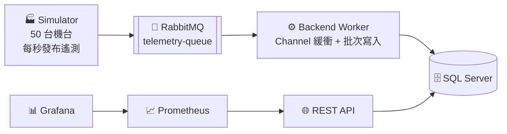

# Factory-IoT-Ingestion-System
基於 .NET 8、RabbitMQ 與 Channel 批次處理的高吞吐量工廠 IoT 數據採集系統。包含多執行緒設備模擬（50+ 機台）、Prometheus/Grafana 可觀測性監控與 k6 壓測驗證。

## 📚 文件導覽

| 文件 | 內容 | 適合誰 |
|------|------|--------|
| 📐 [系統架構 ARCHITECTURE.md](./docs/ARCHITECTURE.md) | 架構圖、資料流、分層設計、技術決策 | 想了解「系統在幹嘛」 |
| 🛠️ [操作手冊 OPERATIONS.md](./docs/OPERATIONS.md) | 啟動、驗證、監控設定、壓測、故障排除 | 要把系統跑起來、維運 |
| 👩‍💻 [開發者指南 DEVELOPMENT.md](./docs/DEVELOPMENT.md) | 本機開發、加 API、加 Migration、除錯 | 要改程式碼 |
| ✅ [驗證指南 VERIFICATION_GUIDE.md](./VERIFICATION_GUIDE.md) | RabbitMQ→MSSQL 資料流驗證與診斷 | 排查資料未入庫問題 |

## 🗺️ 系統一覽



> 詳細架構、資料流時序圖與分層說明請見 [ARCHITECTURE.md](./docs/ARCHITECTURE.md)。

## 🚀 快速開始

### 前置需求
- Docker & Docker Compose
- (選用) k6 - 用於負載測試

### 1. 啟動基礎設施與服務

啟動所有服務（RabbitMQ、SQL Server、Prometheus、Grafana、Backend API、Simulator）：

```bash
docker-compose up -d
```

等待所有服務啟動完成（約 30-60 秒）。可以透過以下指令檢查服務狀態：

```bash
docker-compose ps
```

### 2. 驗證服務運行

- **RabbitMQ Management UI**: http://localhost:15672 (帳號/密碼: `guest`/`guest`)
- **SQL Server**: localhost,1433 (帳號/密碼: `sa`/`IoT_Secret123!`) - 可使用 SSMS 管理
- **Backend API Health**: http://localhost:8080/health
- **Backend API Swagger**: http://localhost:8080/swagger (開發環境)
- **Prometheus**: http://localhost:9090
- **Grafana**: http://localhost:3000 (帳號/密碼: `admin`/`admin`)

### 3. 執行設備模擬器

設備模擬器會自動隨 docker-compose 啟動，模擬 50+ 台機台向 RabbitMQ 發送遙測數據。

查看 Simulator 日誌：

```bash
docker-compose logs -f simulator
```

### 4. 設定 Grafana 監控

#### 4.1 新增 Prometheus Data Source

1. 開啟 Grafana: http://localhost:3000
2. 登入（帳號: `admin`, 密碼: `admin`）
3. 點選左側選單 **Connections** > **Data sources**
4. 點選 **Add data source**
5. 選擇 **Prometheus**
6. 設定以下參數：
   - **Name**: `Prometheus`
   - **URL**: `http://prometheus:9090`
7. 點選 **Save & Test**，確認連線成功

#### 4.2 建立儀表板

可以匯入現有的 .NET 應用程式儀表板模板，或建立自訂儀表板監控以下指標：

- **HTTP 請求速率**: `rate(http_requests_received_total[1m])`
- **HTTP 請求延遲**: `http_request_duration_seconds`
- **錯誤率**: `rate(http_requests_received_total{code=~"5.."}[1m])`

### 5. 執行 k6 負載測試

#### 5.1 安裝 k6

**macOS**:
```bash
brew install k6
```

**Windows (使用 Chocolatey)**:
```bash
choco install k6
```

**Linux**:
```bash
# Debian/Ubuntu
sudo gpg -k
sudo gpg --no-default-keyring --keyring /usr/share/keyrings/k6-archive-keyring.gpg --keyserver hkp://keyserver.ubuntu.com:80 --recv-keys C5AD17C747E3415A3642D57D77C6C491D6AC1D69
echo "deb [signed-by=/usr/share/keyrings/k6-archive-keyring.gpg] https://dl.k6.io/deb stable main" | sudo tee /etc/apt/sources.list.d/k6.list
sudo apt-get update
sudo apt-get install k6
```

或使用 Docker:
```bash
docker pull grafana/k6:latest
```

#### 5.2 運行負載測試

**使用本地 k6**:
```bash
k6 run k6-script.js
```

**使用 Docker**:
```bash
docker run --rm -i --network=host -v $(pwd):/scripts grafana/k6:latest run /scripts/k6-script.js
```

測試配置：
- **VUs (Virtual Users)**: 50
- **持續時間**: 5 分鐘
- **目標 API**: `GET /api/v1/telemetry/{machineId}/latest`
- **閾值**:
  - P95 延遲 < 200ms
  - 錯誤率 < 1%

#### 5.3 解讀測試結果

測試完成後，k6 會顯示摘要報告：

```
✓ status is 200
✓ response has body
✓ response time < 200ms

checks.........................: 100.00% ✓ 30000 ✗ 0
data_received..................: 15 MB   50 kB/s
data_sent......................: 2.5 MB  8.3 kB/s
errors.........................: 0.00%   ✓ 0     ✗ 30000
http_req_duration..............: avg=45ms min=10ms med=40ms max=180ms p(95)=120ms
http_reqs......................: 30000   100/s
vus............................: 50      min=50  max=50
```

## 📊 架構概覽

- **Backend API** (ASP.NET Core): 提供 REST API 與 Prometheus metrics
- **Simulator**: 多執行緒模擬 50+ 台設備發送遙測數據
- **RabbitMQ**: 訊息佇列，處理遙測數據
- **SQL Server**: 儲存遙測數據
- **Prometheus**: 收集 metrics
- **Grafana**: 視覺化監控儀表板

> 📐 完整的架構圖（系統情境圖、容器部署圖、資料流時序圖、Clean Architecture 分層圖、Worker 狀態機）與技術決策說明，請見 **[docs/ARCHITECTURE.md](./docs/ARCHITECTURE.md)**。

## 🔌 主要 API 端點

| 方法 | 路徑 | 說明 |
|------|------|------|
| GET | `/health` · `/health/worker` | 存活檢查 / Worker 詳細狀態（不健康回 503） |
| GET | `/api/v1/telemetry/{machineId}/latest?count=N` | 某台機台最新 N 筆寬表快照 |
| GET | `/api/v1/sensors/{machineId}/readings?count=N&sensorType=` | 某台機台最新 N 筆正規化感測讀值（可依感測器類型篩選） |
| GET | `/api/v1/machines` | **機台總覽**：每台一列彙總（樣本數、首/末回報、溫度與壓力 min/max/avg） |
| GET | `/api/v1/telemetry/{machineId}/stats?windowMinutes=N` | **單機統計**：最近 N 分鐘（預設 60）的聚合；查無資料回 404 |
| GET | `/api/v1/fleet/status?windowMinutes=N` | **全廠健康快照**：回報機台數、總讀值數、狀態分佈 |
| GET | `/metrics` · `/swagger` | Prometheus 指標 / Swagger UI（僅開發環境） |

> 端點細節、curl 範例與參數限制見 **[操作手冊 OPERATIONS.md](./docs/OPERATIONS.md#api-端點一覽)**；`src/FactoryIoT.Presentation/FactoryIoT.Presentation.http` 可在 IDE 內直接點擊發送。

## 🔧 使用 SQL Server Management Studio (SSMS)

您可以使用 SSMS 連接到 SQL Server 容器：

- **伺服器名稱**: `localhost,1433`
- **驗證方式**: SQL Server 驗證
- **登入**: `sa`
- **密碼**: `IoT_Secret123!`
- **資料庫**: `factory_iot`

## 🛑 停止服務

```bash
docker-compose down
```

保留資料卷（RabbitMQ、SQL Server、Prometheus、Grafana 數據）。

若要完全清除所有資料：

```bash
docker-compose down -v
```
