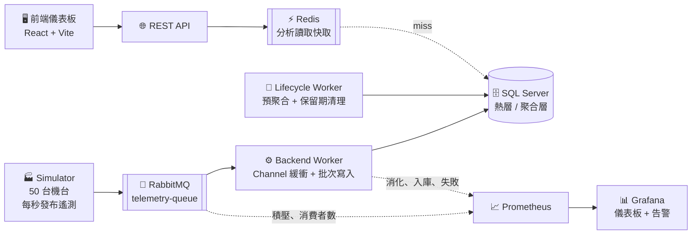

# Factory-IoT-Ingestion-System
基於 .NET 8、RabbitMQ 與 Channel 批次處理的高吞吐量工廠 IoT 數據採集系統。包含多執行緒設備模擬（50+ 機台）、Prometheus/Grafana 可觀測性監控與 k6 壓測驗證。

## 📚 文件導覽

| 文件 | 內容 | 適合誰 |
|------|------|--------|
| 📐 [系統架構 ARCHITECTURE.md](./docs/ARCHITECTURE.md) | 架構圖、資料流、分層設計、技術決策 | 想了解「系統在幹嘛」 |
| 🗄️ [資料生命週期 DATA-LIFECYCLE.md](./docs/DATA-LIFECYCLE.md) | 冷熱分層、預聚合、保留期、容量規劃與擴充路線 | 擔心「資料越存越多怎麼辦」 |
| ⚡ [讀取快取 CACHING.md](./docs/CACHING.md) | 為什麼導入 Redis、用在哪、fail-open 設計、設定與運維 | 想知道「為什麼有 Redis、快取怎麼運作」 |
| 🛠️ [操作手冊 OPERATIONS.md](./docs/OPERATIONS.md) | 啟動、驗證、監控設定、壓測、故障排除 | 要把系統跑起來、維運 |
| 🚨 [監控與告警 MONITORING.md](./docs/MONITORING.md) | 儀表板導覽、19 條告警規則、門檻怎麼調、積壓演練 | 要知道「出事會不會有人通知我」 |
| 👩‍💻 [開發者指南 DEVELOPMENT.md](./docs/DEVELOPMENT.md) | 本機開發、加 API、加 Migration、除錯 | 要改程式碼 |
| 🚀 [發布流程 RELEASE.md](./docs/RELEASE.md) | 改完程式碼後怎麼重新打包、發布、驗證、回滾 | 改完了要發上去 |
| ✅ [驗證指南 VERIFICATION_GUIDE.md](./VERIFICATION_GUIDE.md) | RabbitMQ→MSSQL 資料流驗證與診斷 | 排查資料未入庫問題 |
| 🖥️ [前端儀表板 frontend/README.md](./frontend/README.md) | React 即時監控儀表板:安裝、開發、Docker | 想看資料視覺化畫面 |

## 🗺️ 系統一覽


```mermaid
flowchart LR
    SIM["🏭 Simulator<br/>50 台機台<br/>每秒發布遙測"] --> MQ[["🐇 RabbitMQ<br/>telemetry-queue"]]
    MQ --> W["⚙️ Backend Worker<br/>Channel 緩衝 + 批次寫入"]
    W --> DB[("🗄️ SQL Server<br/>熱層 / 聚合層")]
    LIFE["🧹 Lifecycle Worker<br/>預聚合 + 保留期清理"] --> DB
    API["🌐 REST API"] --> CACHE[["⚡ Redis<br/>分析讀取快取"]]
    CACHE -. "miss" .-> DB
    DASH["🖥️ 前端儀表板<br/>React + Vite"] --> API
    MQ -.積壓、消費者數.-> PROM["📈 Prometheus"]
    W -.消化、入庫、失敗.-> PROM
    PROM --> GRAF["📊 Grafana<br/>儀表板 + 告警"]
```

> 分析讀取端點前有一層短 TTL 的 Redis 快取(cache-aside、fail-open),把儀表板/壓測的重複查詢擋在受限的 SQL Server Express 之外;Redis 掛掉會透明退回查 DB。詳見 [CACHING.md](./docs/CACHING.md)。

> 詳細架構、資料流時序圖與分層說明請見 [ARCHITECTURE.md](./docs/ARCHITECTURE.md)。

## 🚀 快速開始

### 前置需求
- Docker & Docker Compose
- (選用) k6 - 用於負載測試

### 1. 啟動基礎設施與服務

啟動所有服務（RabbitMQ、SQL Server、Redis、Prometheus、Grafana、Backend API、Simulator）：

```bash
docker-compose up -d
```

等待所有服務啟動完成（約 30-60 秒）。可以透過以下指令檢查服務狀態：

```bash
docker-compose ps
```

### 2. 驗證服務運行

- **前端儀表板 (Dashboard)**: http://localhost:8081 - 即時監控畫面(主要使用者介面)
- **Grafana 監控與告警**: http://localhost:3000 (帳號/密碼: `admin`/`admin`) - 儀表板與告警已預先設定好
- **RabbitMQ Management UI**: http://localhost:15672 (帳號/密碼: `guest`/`guest`)
- **RabbitMQ Metrics**: http://localhost:15692/metrics (Prometheus 格式，含佇列積壓)
- **SQL Server**: localhost,1433 (帳號/密碼: `sa`/`IoT_Secret123!`) - 可使用 SSMS 管理
- **Redis**: localhost:6379 - 分析讀取快取（`redis-cli KEYS 'factoryiot:*'` 可檢視）
- **Backend API Health**: http://localhost:8080/health
- **Backend API Swagger**: http://localhost:8080/swagger (開發環境)
- **Prometheus**: http://localhost:9090

### 3. 執行設備模擬器

設備模擬器會自動隨 docker-compose 啟動，模擬 50+ 台機台向 RabbitMQ 發送遙測數據。

查看 Simulator 日誌：

```bash
docker-compose logs -f simulator
```

### 4. 監控與告警（開箱即用，不用手動設定）

資料來源、儀表板、告警規則全部是從 `grafana/` 底下**自動 provisioning** 進去的。
`docker compose up -d` 之後打開 http://localhost:3000 登入，**直接就是**
〈① MQ 積壓與 Worker 消化〉—— 不需要加 data source、不需要自己拉圖表、不需要在 UI 裡建告警。

**三張儀表板**（Grafana 的 `Factory IoT` 資料夾）：

| 儀表板 | 看什麼 |
|--------|--------|
| ① MQ 積壓與 Worker 消化 | 佇列積壓、消費者數、發布 vs 消化 vs 入庫、瓶頸在哪一段 |
| ② RabbitMQ Broker 健康 | 連線 / 資源水位警報 / 各佇列明細 |
| ③ API 與資料庫寫入 | REST API 延遲與錯誤率、批次寫入效能 |

**19 條告警規則**，其中直接對應「MQ 一直累積、Worker 沒在消化」的有：

- 🔴 **佇列沒有任何消費者** — `rabbitmq_queue_consumers = 0` 持續 2 分鐘
- 🔴 **有積壓但完全沒有消化** — 佇列有 200 筆以上待處理，但消化速率是 0
- 🔴 **Worker 不健康** — 未連上 MQ 或批次處理停擺
- 🟠 **MQ 積壓警戒 / 嚴重** — 待處理超過 1000 / 10000 筆
- 🟠 **積壓持續成長** — 還沒超標，但斜率已經連續 15 分鐘往上

告警會直接顯示在第一張儀表板的〈🔔 目前告警〉面板，也在 **Alerting → Alert rules**。
每條都附有具體的處理步驟。

想親眼看它燒起來？`docker compose stop backend-api`，兩分鐘內告警就會亮。

> 📖 儀表板逐一導覽、19 條規則的完整條件、門檻怎麼調、通知怎麼接 Slack／Email，
> 全部在 **[docs/MONITORING.md](./docs/MONITORING.md)**。

### 5. 執行 k6 負載測試

#### 5.1 安裝 k6

**macOS**:
```bash
brew install k6
```

**Windows (使用 Chocolatey)**:
```bash
choco install k6
```

**Linux**:
```bash
# Debian/Ubuntu
sudo gpg -k
sudo gpg --no-default-keyring --keyring /usr/share/keyrings/k6-archive-keyring.gpg --keyserver hkp://keyserver.ubuntu.com:80 --recv-keys C5AD17C747E3415A3642D57D77C6C491D6AC1D69
echo "deb [signed-by=/usr/share/keyrings/k6-archive-keyring.gpg] https://dl.k6.io/deb stable main" | sudo tee /etc/apt/sources.list.d/k6.list
sudo apt-get update
sudo apt-get install k6
```

或使用 Docker:
```bash
docker pull grafana/k6:latest
```

#### 5.2 運行負載測試

**使用本地 k6**:
```bash
k6 run k6-script.js
```

**使用 Docker**:
```bash
docker run --rm -i --network=host -v $(pwd):/scripts grafana/k6:latest run /scripts/k6-script.js
```

測試配置：
- **VUs (Virtual Users)**: 50
- **持續時間**: 5 分鐘
- **目標 API**: `GET /api/v1/telemetry/{machineId}/latest`
- **閾值**:
  - P95 延遲 < 200ms
  - 錯誤率 < 1%

#### 5.3 解讀測試結果

測試完成後，k6 會顯示摘要報告：

```
✓ status is 200
✓ response has body
✓ response time < 200ms

checks.........................: 100.00% ✓ 30000 ✗ 0
data_received..................: 15 MB   50 kB/s
data_sent......................: 2.5 MB  8.3 kB/s
errors.........................: 0.00%   ✓ 0     ✗ 30000
http_req_duration..............: avg=45ms min=10ms med=40ms max=180ms p(95)=120ms
http_reqs......................: 30000   100/s
vus............................: 50      min=50  max=50
```

## 📊 架構概覽

- **Frontend Dashboard** (React + Vite): 即時監控儀表板,讀取 REST API 呈現廠區與單機遙測
- **Backend API** (ASP.NET Core): 提供 REST API 與 Prometheus metrics
- **Simulator**: 多執行緒模擬 50+ 台設備發送遙測數據
- **RabbitMQ**: 訊息佇列，處理遙測數據（同時透過 :15692 輸出佇列積壓指標）
- **SQL Server**: 分層儲存遙測數據 —— 熱層保留逐筆原始資料數十小時，更久的歷史以每分鐘／每小時的預聚合時間桶保存，資料庫大小因此穩定而非無限成長（見 [DATA-LIFECYCLE.md](./docs/DATA-LIFECYCLE.md)）
- **Prometheus**: 同時收集 Backend API 與 RabbitMQ 的 metrics
- **Grafana**: 儀表板與告警，皆由 `grafana/` 自動 provisioning

> 📐 完整的架構圖（系統情境圖、容器部署圖、資料流時序圖、Clean Architecture 分層圖、Worker 狀態機）與技術決策說明，請見 **[docs/ARCHITECTURE.md](./docs/ARCHITECTURE.md)**。

## 🔌 主要 API 端點

| 方法 | 路徑 | 說明 |
|------|------|------|
| GET | `/health` · `/health/worker` | 存活檢查 / Worker 詳細狀態（不健康回 503） |
| GET | `/api/v1/telemetry/{machineId}/latest?count=N` | 某台機台最新 N 筆寬表快照 |
| GET | `/api/v1/sensors/{machineId}/readings?count=N&sensorType=` | 某台機台最新 N 筆正規化感測讀值（可依感測器類型篩選） |
| GET | `/api/v1/machines` | **機台總覽**：每台一列彙總（樣本數、首/末回報、溫度與壓力 min/max/avg） |
| GET | `/api/v1/telemetry/{machineId}/stats?windowMinutes=N` | **單機統計**：最近 N 分鐘（預設 60）的聚合；查無資料回 404 |
| GET | `/api/v1/fleet/status?windowMinutes=N` | **全廠健康快照**：回報機台數、總讀值數、狀態分佈 |
| GET | `/api/v1/data-lifecycle` | **儲存分層現況**：各層資料範圍、聚合落後秒數、保留期設定 |
| GET | `/metrics` · `/swagger` | Prometheus 指標 / Swagger UI（僅開發環境） |

> 端點細節、curl 範例與參數限制見 **[操作手冊 OPERATIONS.md](./docs/OPERATIONS.md#api-端點一覽)**；`src/FactoryIoT.Presentation/FactoryIoT.Presentation.http` 可在 IDE 內直接點擊發送。

## 🔧 使用 SQL Server Management Studio (SSMS)

您可以使用 SSMS 連接到 SQL Server 容器：

- **伺服器名稱**: `localhost,1433`
- **驗證方式**: SQL Server 驗證
- **登入**: `sa`
- **密碼**: `IoT_Secret123!`
- **資料庫**: `factory_iot`

## 🛑 停止服務

```bash
docker-compose down
```

保留資料卷（RabbitMQ、SQL Server、Prometheus、Grafana 數據）。

若要完全清除所有資料：

```bash
docker-compose down -v
```
