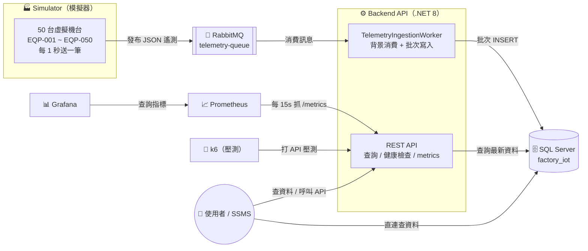
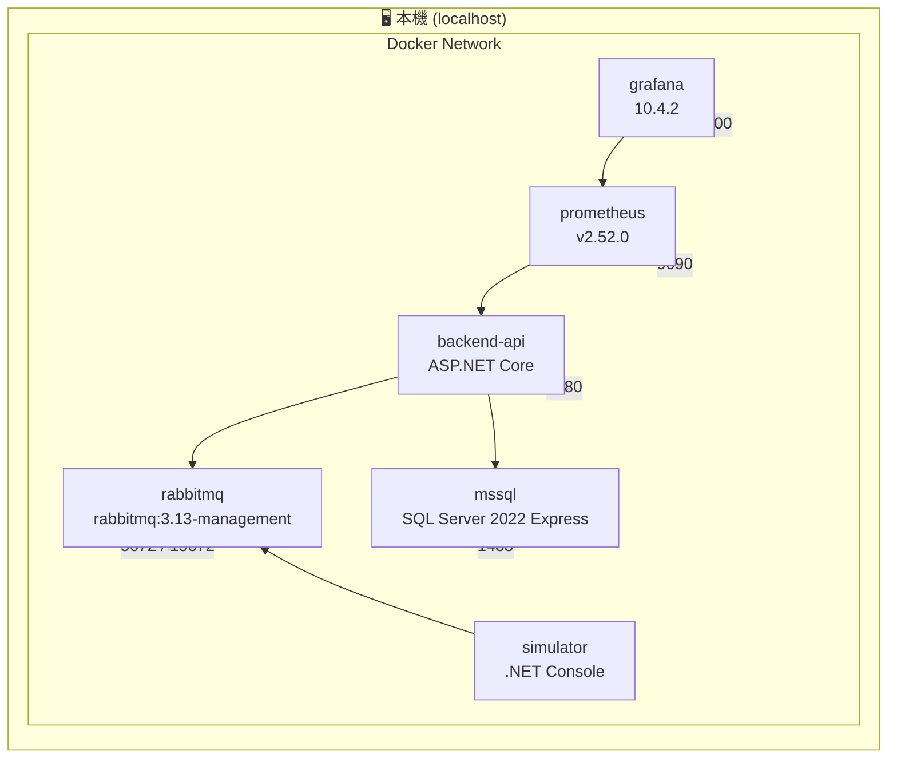
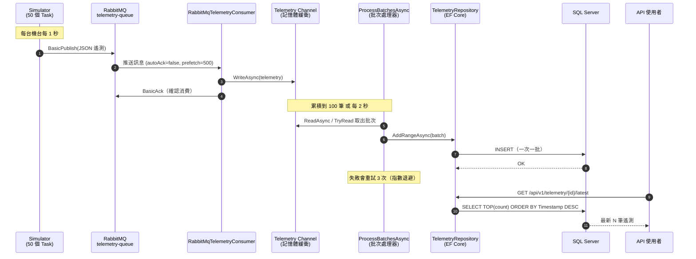
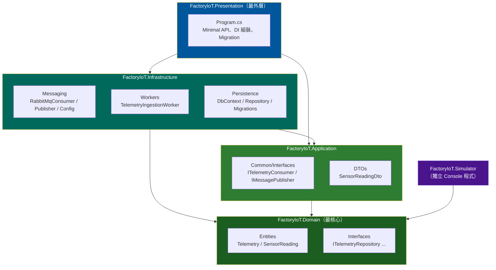
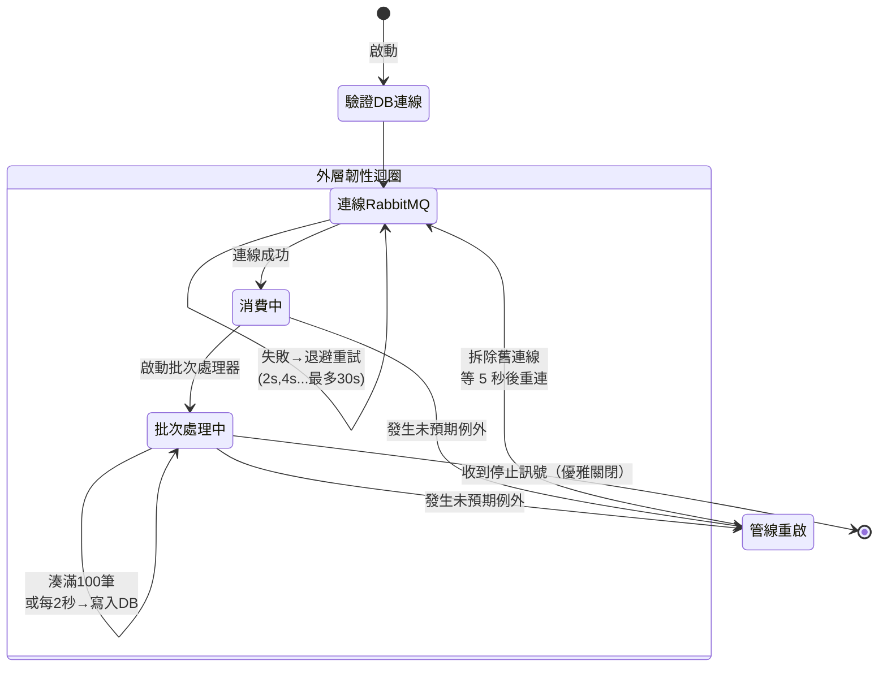
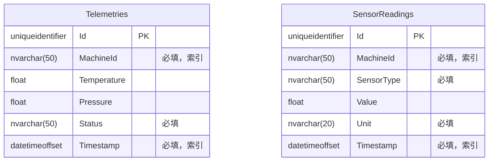

# 系統架構文件（Architecture）

本文件說明 **Factory IoT Ingestion System** 的整體架構、資料流、分層設計，以及重要的技術決策，讓你能快速掌握「這個系統在幹嘛、每一塊負責什麼」。

> 📌 想直接動手操作，請看 [操作手冊 OPERATIONS.md](./OPERATIONS.md)；想改程式碼，請看 [開發者指南 DEVELOPMENT.md](./DEVELOPMENT.md)。

---

## 1. 這個系統在做什麼？

一句話：**模擬 50 台工廠機台不斷送出感測數據，透過訊息佇列高吞吐地寫入資料庫，並提供 API 查詢與監控儀表板。**

它是一個典型的 **IoT 資料擷取（Ingestion）管線** 範例，重點在於展示：

- 用 **RabbitMQ** 當緩衝，把「產生資料」與「寫入資料庫」解耦
- 用 **.NET Channel + 批次寫入** 消化高吞吐量的訊息
- 用 **Prometheus + Grafana** 做可觀測性（Observability）
- 用 **k6** 做 API 壓力測試
- 全部用 **Docker Compose** 一鍵啟動

---

## 2. 系統情境圖（System Context）

最上層的鳥瞰視角 — 系統由哪些角色組成、彼此怎麼互動：

---

## 3. 容器部署圖（Deployment / Docker Compose）

整套系統由 `docker-compose.yml` 定義的 **6 個容器** 組成，全部跑在同一個 Docker 網路上：

**對外開放的埠（Port）與啟動依賴：**

| 容器 | 對外埠 | 用途 | 依賴（depends_on） |
|------|--------|------|--------------------|
| `rabbitmq` | 5672 (AMQP) / 15672 (管理 UI) | 訊息佇列 | — |
| `mssql` | 1433 | 關聯式資料庫 | — |
| `backend-api` | 8080 | REST API + `/metrics` | rabbitmq、mssql（healthy 後才啟動） |
| `simulator` | —（不對外） | 產生遙測資料 | rabbitmq（healthy 後才啟動） |
| `prometheus` | 9090 | 指標收集 | — |
| `grafana` | 3000 | 監控儀表板 | prometheus |

> `rabbitmq` 與 `mssql` 都設定了 `healthcheck`，`backend-api` / `simulator` 會等它們變成 healthy 後才啟動，避免競態（race condition）。

---

## 4. 端到端資料流（End-to-End Data Flow）

這是整個系統最核心的一條路徑 — 一筆遙測資料從「產生」到「入庫」再到「被查詢」：

**分段說明：**

1. **產生（Produce）** — `Simulator` 用 50 個獨立的 `Task`，每台機台每秒把一筆 `Telemetry`（機台代號、溫度、壓力、狀態、時間戳）序列化成 JSON，發布到 `telemetry-queue`。
2. **緩衝（Buffer）** — RabbitMQ 是持久化（durable）佇列，即使消費端一時掛掉，訊息也不會遺失。
3. **消費（Consume）** — `RabbitMqTelemetryConsumer` 以手動確認（`autoAck=false`）方式消費，並設定 `prefetch=500` 做背壓（backpressure），避免 broker 一次把整個 backlog 塞給消費端。
4. **記憶體緩衝（Channel）** — 收到的訊息先寫進 `Channel<Telemetry>`（single-reader / multi-writer），把「消費速率」與「寫庫速率」解耦。
5. **批次寫入（Batch Insert）** — `ProcessBatchesAsync` 湊滿 100 筆或每 2 秒觸發一次，一次把整批 `INSERT` 進 SQL Server，大幅提升吞吐量。
6. **查詢（Query）** — REST API 直接從資料庫讀取指定機台的最新 N 筆資料。

---

## 5. 專案分層（Clean Architecture）

程式碼採用 **Clean Architecture（乾淨架構）**，依賴方向一律「由外向內」，核心（Domain）不依賴任何外部技術：

### 各層職責

| 專案 | 角色 | 相依於 | 主要內容 |
|------|------|--------|----------|
| **FactoryIoT.Domain** | 核心領域（無任何外部相依） | 無 | 實體 `Telemetry`、`SensorReading`；分析 read-model `MachineTelemetrySummary`／`TelemetryStatistics`／`FleetStatus`（`Analytics/`）；儲存庫介面 `ITelemetryRepository`、`ISensorReadingRepository` |
| **FactoryIoT.Application** | 應用契約 / 使用案例邊界 | Domain | 資料傳輸物件 `SensorReadingDto`；訊息介面 `ITelemetryConsumer`、`IMessagePublisher` |
| **FactoryIoT.Infrastructure** | 外部技術實作 | Domain、Application | RabbitMQ 消費/發布、`TelemetryIngestionWorker`、EF Core `DbContext` 與 Repository、Migrations |
| **FactoryIoT.Presentation** | 對外入口（Web API） | Application、Infrastructure | `Program.cs`（Minimal API 端點、DI 註冊、啟動時跑 Migration） |
| **FactoryIoT.Simulator** | 資料產生器（獨立程式） | Domain | 模擬 50 台機台發布遙測 |

> **為什麼這樣分？** 介面（如 `ITelemetryRepository`）定義在內層（Domain / Application），實作（如 `TelemetryRepository`）放在外層（Infrastructure）。這就是**依賴反轉（Dependency Inversion）**：核心邏輯不知道也不在乎資料是存進 SQL Server、PostgreSQL 還是記憶體，換底層技術時核心層完全不用動。

---

## 6. Backend Worker 內部運作

`TelemetryIngestionWorker` 是整個系統最關鍵的元件（一個 .NET `BackgroundService`）。它的內部是一個具備自我修復能力的狀態機：

### 幾個關鍵機制

- **雙路徑批次觸發** — `ProcessBatchesAsync` 同時等待「Channel 有新資料」與「2 秒計時器」，用 `Task.WhenAny` 擇一觸發。湊滿 `BatchSize=100` 立即寫，否則每 `BatchInterval=2s` 把手上的資料 flush 一次。
- **寫入重試** — `FlushBatchAsync` 失敗時最多重試 3 次，採指數退避（2s、4s…）；3 次都失敗會記 `telemetry_failed_total` 並發出 `CRITICAL` 日誌（代表資料遺失）。
- **自我修復** — 只要不是收到取消訊號，任何逸出管線的例外都會被外層迴圈接住，拆掉舊的 RabbitMQ 連線，等 5 秒後整條管線重建。這避免了「Worker 默默死掉、`/health/worker` 永遠 503」的問題。
- **不拖垮主機** — `Program.cs` 設定 `BackgroundServiceExceptionBehavior.Ignore`，即使 Worker 真的爆掉，API 與健康檢查端點仍能繼續服務。
- **健康狀態** — `IsHealthy = _isConnected && _isProcessing`，透過 `/health/worker` 對外暴露，並附上「最後收到訊息 / 最後寫入」的時間戳。

---

## 7. 資料模型（Database Schema）

資料庫 `factory_iot` 由 EF Core Migration（`InitialCreate`）建立兩張表：

- 兩張表都在 `(MachineId, Timestamp)` 上建立**複合索引**，正好對應「查某台機台最新 N 筆（依時間倒序）」的查詢模式。
- **兩張表現在都會即時寫入**：Worker 每次批次落庫時，會把每筆寬表 `Telemetry`（溫度、壓力）拆解成正規化的 `SensorReading`（每個感測器一列），在**同一個交易**裡同時寫進 `Telemetries` 與 `SensorReadings`，兩表資料因此保持一致（見下方「架構備註」）。
  - `Telemetries`：一台機台某一瞬間的**寬表快照**（一列含所有指標）。
  - `SensorReadings`：**正規化的每感測器時序**，可回答寬表答不了的問題，例如「給我 EQP-001 最近 20 筆壓力讀值」，且新增感測器類型時免改 schema。

---

## 8. 可觀測性（Observability）

系統透過 `prometheus-net` 暴露以下自訂指標，Prometheus 每 15 秒抓一次 `backend-api:8080/metrics`：

| 指標名稱 | 型別 | 意義 |
|----------|------|------|
| `telemetry_consumed_total` | Counter | 從 RabbitMQ 消費的訊息總數 |
| `telemetry_written_total` | Counter | 成功寫入 `Telemetries` 的記錄總數 |
| `sensor_readings_written_total` | Counter | 成功寫入 `SensorReadings` 的正規化讀值總數（每筆 Telemetry 拆成多筆） |
| `telemetry_failed_total` | Counter | 重試後仍寫入失敗（資料遺失）的記錄總數 |
| `telemetry_batch_processing_seconds` | Histogram | 每批次寫入耗時分布 |

此外 `app.UseHttpMetrics()` 會自動產生標準的 HTTP 指標（`http_request_duration_seconds`、`http_requests_received_total` 等）。

**健康的系統應該滿足：** `rate(telemetry_consumed_total)` ≈ `rate(telemetry_written_total)`，且 `telemetry_failed_total` 保持為 0。

---

## 9. 技術棧（Technology Stack）

| 分類 | 技術 | 版本 |
|------|------|------|
| 執行環境 | .NET | 8.0 |
| Web 框架 | ASP.NET Core Minimal API | 8.0 |
| ORM | Entity Framework Core（SqlServer provider） | 8.0.4 |
| 資料庫 | SQL Server 2022 Express | 2022-latest |
| 訊息佇列 | RabbitMQ（`RabbitMQ.Client`） | 3.13 / 7.1.2 |
| 指標 | prometheus-net | 8.2.1 |
| 指標收集 | Prometheus | v2.52.0 |
| 儀表板 | Grafana | 10.4.2 |
| 壓測 | k6 | latest |
| 容器編排 | Docker Compose | — |

---

## 10. 重要技術決策（Design Decisions）

| 決策 | 為什麼 |
|------|--------|
| **RabbitMQ 當緩衝層** | 把「產資料」與「寫資料庫」解耦。DB 忙時訊息先在佇列排隊，不會反壓到機台端。 |
| **Channel + 批次寫入** | 單筆 INSERT 在高吞吐下會拖垮 DB；湊成 100 筆一次寫，大幅減少往返次數。Channel 讓消費與寫入各自跑在自己的節奏。 |
| **手動 Ack + durable 佇列** | 達成「至少一次（at-least-once）」投遞語意 — 訊息成功進 Channel 才 Ack，消費端崩潰時未確認的訊息會重新投遞。 |
| **prefetch=500** | 限制 broker 一次推送的未確認訊息數，避免整個 backlog 灌爆記憶體，同時提供背壓。 |
| **自我修復管線** | 讓 Worker 能從短暫的 broker / DB 故障中自動復原，不需要人工重啟容器。 |
| **啟動時自動 Migration** | `Program.cs` 開機即 `MigrateAsync()`，容器起來資料表就緒，零手動步驟。 |
| **環境變數優先於設定檔** | `RABBITMQ_*` 環境變數優先於 `appsettings.json`，讓 docker-compose 能覆寫連線目標（見下）。 |

### ⚠️ 一個曾經踩過的雷：RabbitMQ 主機解析

`Program.cs` 中的 `EnvOrConfig` 特別**先讀 `RABBITMQ_HOST` 環境變數，再讀 appsettings**。原因是：單底線的 `RABBITMQ_HOST` 不會像 ASP.NET 慣例的雙底線（`RabbitMQ__Host`）那樣自動綁定到設定階層。如果先讀 appsettings，裡面寫死的 `localhost` 永遠會贏，導致 Worker 在自己的容器裡撥打 `localhost` 而永遠連不到 broker。順序必須是：**環境變數 → appsettings → 預設值**。

---

## 11. 架構備註：實際運作 vs. 骨架程式碼

為了讓你完全清楚「哪些程式碼是真的在跑」，這裡誠實標註：

✅ **實際在運作的管線（Telemetry + SensorReading 落庫）：**
`Simulator` → `telemetry-queue`（default exchange）→ `RabbitMqTelemetryConsumer` → `Channel` → `TelemetryIngestionWorker` → **同一交易**中 `TelemetryRepository` → `Telemetries` 表**且** `SensorReadingRepository` → `SensorReadings` 表。

Worker 落庫時透過 `SensorReading.FromTelemetry(...)` 把每筆寬表快照拆成正規化讀值（`Temperature`／`Pressure`），對外再由 `GET /api/v1/sensors/{machineId}/readings?sensorType=&count=` 讀回（回應型別為 `SensorReadingDto`）。因此 `SensorReading` 實體、`ISensorReadingRepository`、`SensorReadingRepository`、`SensorReadingDto`、`SensorReadings` 表**現在全都在執行路徑上**。

✅ **監控／分析查詢（read 端）：** `GET /api/v1/machines`、`GET /api/v1/telemetry/{machineId}/stats` 與 `GET /api/v1/fleet/status` 把「機台總覽、單機時間窗統計、全廠健康快照」下推到 SQL Server 以 `GROUP BY` 聚合，回傳 `FactoryIoT.Domain.Analytics` 下的 read-model record（`MachineTelemetrySummary`／`TelemetryStatistics`／`FleetStatus`）。這條 read 路徑只讀 `Telemetries` 表、不參與寫入，因此不影響上面的落庫管線。

🚧 **仍未接上的骨架程式碼：**

- `RabbitMqPublisher`（發布到 `iot.readings` fanout exchange）/ `IMessagePublisher`

這是預留給「另一條獨立發布管線」的擴充點，目前**沒有被任何執行路徑使用**（DI 容器裡也沒有註冊 `IMessagePublisher`）。理解系統時可以先忽略它，聚焦在上面的落庫管線即可。

### 已修正的小落差

- **k6 壓測的機台代號**：`k6-script.js` 的 `machineIds` 已對齊模擬器實際產生的 `EQP-001` ~ `EQP-050`，壓測現在會打到真實資料。
- **`.http` 範例檔**：已從專案範本殘留的 `/weatherforecast/` 改為實際端點（含健康檢查、遙測／感測查詢與下方的分析端點），可直接在 IDE 內點擊發送。

---

## 12. 延伸閱讀

- 🛠️ [操作手冊 OPERATIONS.md](./OPERATIONS.md) — 啟動、驗證、監控設定、壓測、故障排除
- 👩‍💻 [開發者指南 DEVELOPMENT.md](./DEVELOPMENT.md) — 本機開發、加 API、加 Migration、除錯
- 📄 [根目錄 README.md](../README.md) — 快速開始
