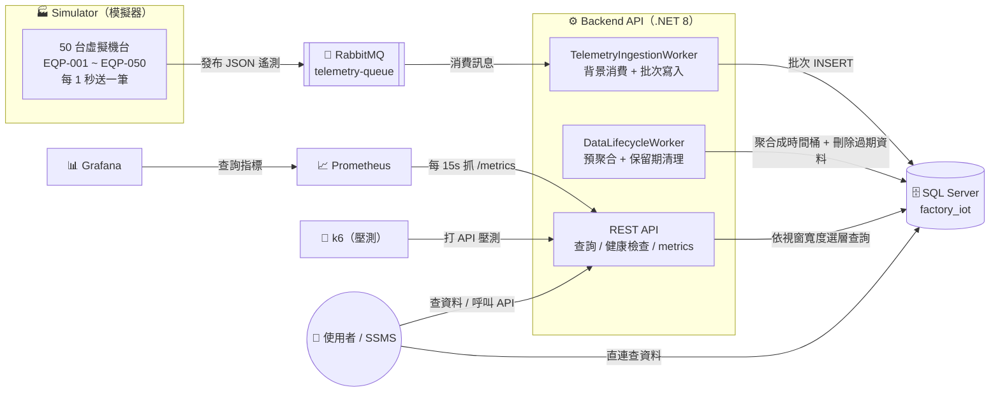
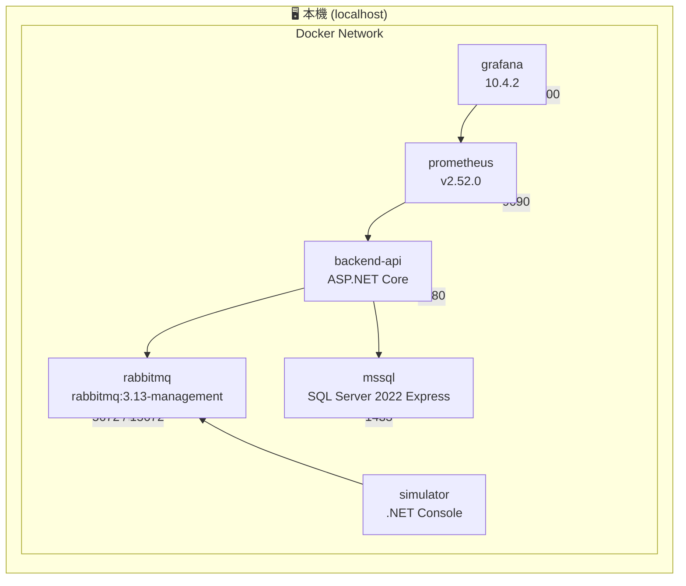
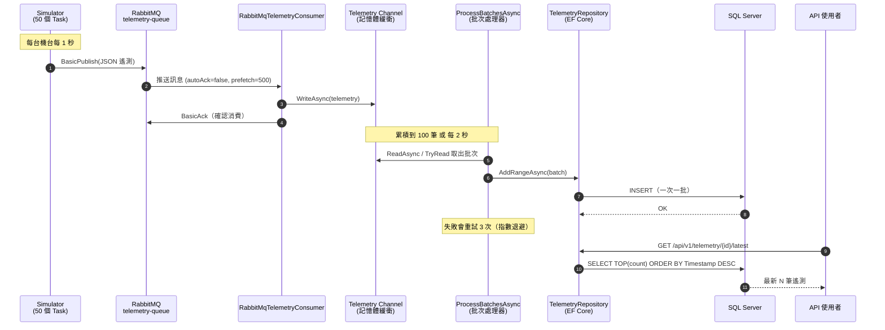
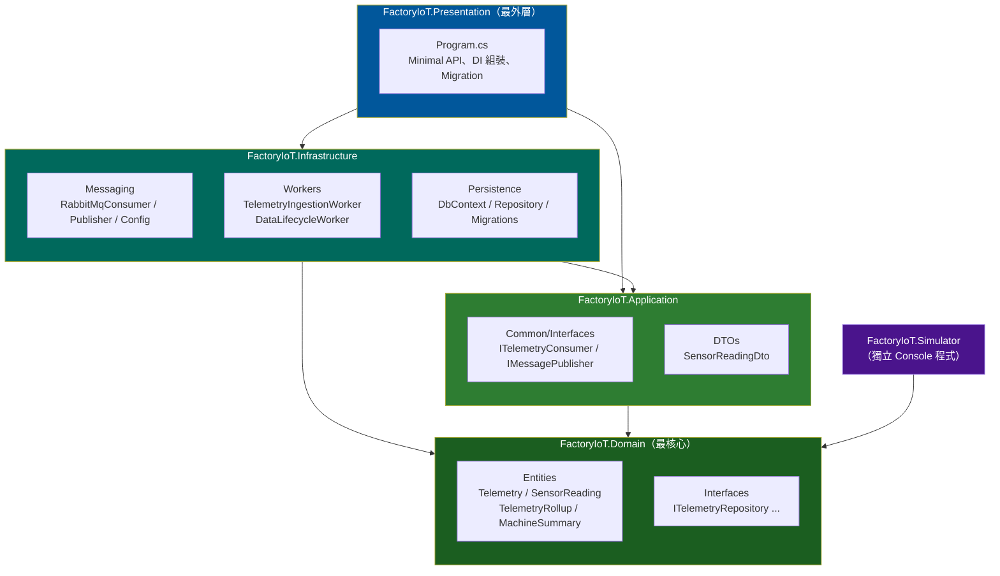
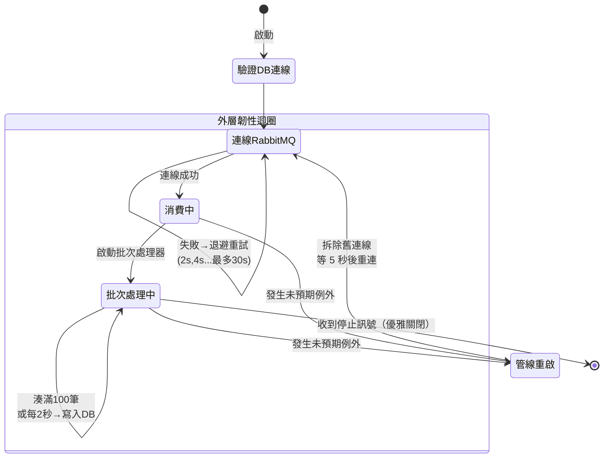
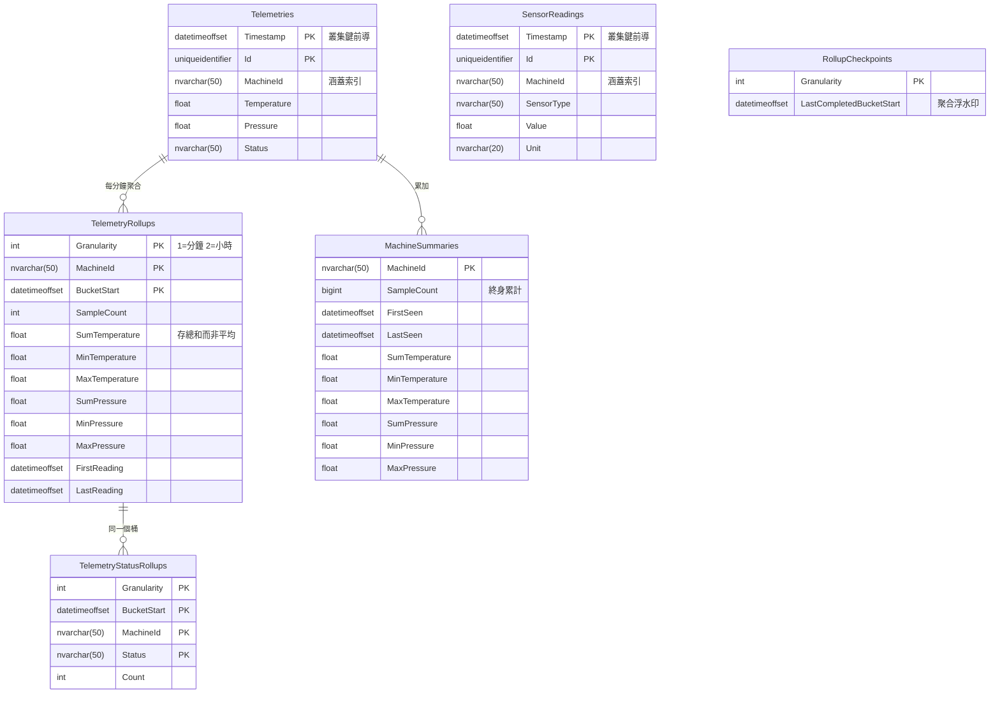

# 系統架構文件（Architecture）

本文件說明 **Factory IoT Ingestion System** 的整體架構、資料流、分層設計，以及重要的技術決策，讓你能快速掌握「這個系統在幹嘛、每一塊負責什麼」。

> 📌 想直接動手操作，請看 [操作手冊 OPERATIONS.md](./OPERATIONS.md)；想改程式碼，請看 [開發者指南 DEVELOPMENT.md](./DEVELOPMENT.md)；擔心資料越存越多，請看 [資料生命週期 DATA-LIFECYCLE.md](./DATA-LIFECYCLE.md)。

---

## 1. 這個系統在做什麼？

一句話：**模擬 50 台工廠機台不斷送出感測數據，透過訊息佇列高吞吐地寫入資料庫，並提供 API 查詢與監控儀表板。**

它是一個典型的 **IoT 資料擷取（Ingestion）管線** 範例，重點在於展示：

- 用 **RabbitMQ** 當緩衝，把「產生資料」與「寫入資料庫」解耦
- 用 **.NET Channel + 批次寫入** 消化高吞吐量的訊息
- 用 **Prometheus + Grafana** 做可觀測性（Observability）
- 用 **k6** 做 API 壓力測試
- 全部用 **Docker Compose** 一鍵啟動

---

## 2. 系統情境圖（System Context）

最上層的鳥瞰視角 — 系統由哪些角色組成、彼此怎麼互動：

```mermaid
flowchart LR
    subgraph sim["🏭 Simulator（模擬器）"]
        M["50 台虛擬機台<br/>EQP-001 ~ EQP-050<br/>每 1 秒送一筆"]
    end

    subgraph core["⚙️ Backend API（.NET 8）"]
        W["TelemetryIngestionWorker<br/>背景消費 + 批次寫入"]
        LC["DataLifecycleWorker<br/>預聚合 + 保留期清理"]
        API["REST API<br/>查詢 / 健康檢查 / metrics"]
    end

    MQ[["🐇 RabbitMQ<br/>telemetry-queue"]]
    DB[("🗄️ SQL Server<br/>factory_iot")]
    PROM["📈 Prometheus"]
    GRAF["📊 Grafana"]
    K6["🧪 k6（壓測）"]
    USER(("👤 使用者 / SSMS"))

    M -- "發布 JSON 遙測" --> MQ
    MQ -- "消費訊息" --> W
    W -- "批次 INSERT" --> DB
    LC -- "聚合成時間桶 + 刪除過期資料" --> DB
    API -- "依視窗寬度選層查詢" --> DB
    PROM -- "每 15s 抓 /metrics" --> API
    GRAF -- "查詢指標" --> PROM
    K6 -- "打 API 壓測" --> API
    USER -- "查資料 / 呼叫 API" --> API
    USER -- "直連查資料" --> DB
```

---

## 3. 容器部署圖（Deployment / Docker Compose）

整套系統由 `docker-compose.yml` 定義的 **6 個容器** 組成，全部跑在同一個 Docker 網路上：

```mermaid
flowchart TB
    subgraph host["🖥️ 本機 (localhost)"]
        direction TB
        subgraph net["Docker Network"]
            R["rabbitmq<br/>rabbitmq:3.13-management"]
            S["mssql<br/>SQL Server 2022 Express"]
            B["backend-api<br/>ASP.NET Core"]
            SI["simulator<br/>.NET Console"]
            P["prometheus<br/>v2.52.0"]
            G["grafana<br/>10.4.2"]
        end
    end

    SI --> R
    B --> R
    B --> S
    P --> B
    G --> P

    R -.->|"5672 / 15672"| host
    S -.->|"1433"| host
    B -.->|"8080"| host
    P -.->|"9090"| host
    G -.->|"3000"| host
```

**對外開放的埠（Port）與啟動依賴：**

| 容器 | 對外埠 | 用途 | 依賴（depends_on） |
|------|--------|------|--------------------|
| `rabbitmq` | 5672 (AMQP) / 15672 (管理 UI) | 訊息佇列 | — |
| `mssql` | 1433 | 關聯式資料庫 | — |
| `backend-api` | 8080 | REST API + `/metrics` | rabbitmq、mssql（healthy 後才啟動） |
| `simulator` | —（不對外） | 產生遙測資料 | rabbitmq（healthy 後才啟動） |
| `prometheus` | 9090 | 指標收集 | — |
| `grafana` | 3000 | 監控儀表板 | prometheus |

> `rabbitmq` 與 `mssql` 都設定了 `healthcheck`，`backend-api` / `simulator` 會等它們變成 healthy 後才啟動，避免競態（race condition）。

---

## 4. 端到端資料流（End-to-End Data Flow）

這是整個系統最核心的一條路徑 — 一筆遙測資料從「產生」到「入庫」再到「被查詢」：

```mermaid
sequenceDiagram
    autonumber
    participant SIM as Simulator<br/>(50 個 Task)
    participant MQ as RabbitMQ<br/>telemetry-queue
    participant CON as RabbitMqTelemetryConsumer
    participant CH as Telemetry Channel<br/>(記憶體緩衝)
    participant BP as ProcessBatchesAsync<br/>(批次處理器)
    participant REPO as TelemetryRepository<br/>(EF Core)
    participant DB as SQL Server
    participant CLIENT as API 使用者

    Note over SIM: 每台機台每 1 秒
    SIM->>MQ: BasicPublish(JSON 遙測)
    MQ->>CON: 推送訊息 (autoAck=false, prefetch=500)
    CON->>CH: WriteAsync(telemetry)
    CON->>MQ: BasicAck（確認消費）
    Note over CH,BP: 累積到 100 筆 或 每 2 秒
    BP->>CH: ReadAsync / TryRead 取出批次
    BP->>REPO: AddRangeAsync(batch)
    REPO->>DB: INSERT（一次一批）
    DB-->>REPO: OK
    Note over BP: 失敗會重試 3 次（指數退避）

    CLIENT->>REPO: GET /api/v1/telemetry/{id}/latest
    REPO->>DB: SELECT TOP(count) ORDER BY Timestamp DESC
    DB-->>CLIENT: 最新 N 筆遙測
```

**分段說明：**

1. **產生（Produce）** — `Simulator` 用 50 個獨立的 `Task`，每台機台每秒把一筆 `Telemetry`（機台代號、溫度、壓力、狀態、時間戳）序列化成 JSON，發布到 `telemetry-queue`。
2. **緩衝（Buffer）** — RabbitMQ 是持久化（durable）佇列，即使消費端一時掛掉，訊息也不會遺失。
3. **消費（Consume）** — `RabbitMqTelemetryConsumer` 以手動確認（`autoAck=false`）方式消費，並設定 `prefetch=500` 做背壓（backpressure），避免 broker 一次把整個 backlog 塞給消費端。
4. **記憶體緩衝（Channel）** — 收到的訊息先寫進 `Channel<Telemetry>`（single-reader / multi-writer），把「消費速率」與「寫庫速率」解耦。
5. **批次寫入（Batch Insert）** — `ProcessBatchesAsync` 湊滿 100 筆或每 2 秒觸發一次，一次把整批 `INSERT` 進 SQL Server，大幅提升吞吐量。
6. **查詢（Query）** — REST API 直接從資料庫讀取指定機台的最新 N 筆資料。

---

## 5. 專案分層（Clean Architecture）

程式碼採用 **Clean Architecture（乾淨架構）**，依賴方向一律「由外向內」，核心（Domain）不依賴任何外部技術：

```mermaid
flowchart TB
    subgraph P["FactoryIoT.Presentation（最外層）"]
        direction TB
        PROG["Program.cs<br/>Minimal API、DI 組裝、Migration"]
    end

    subgraph INF["FactoryIoT.Infrastructure"]
        direction TB
        MSG["Messaging<br/>RabbitMqConsumer / Publisher / Config"]
        WRK["Workers<br/>TelemetryIngestionWorker<br/>DataLifecycleWorker"]
        PER["Persistence<br/>DbContext / Repository / Migrations"]
    end

    subgraph APP["FactoryIoT.Application"]
        direction TB
        IFACE["Common/Interfaces<br/>ITelemetryConsumer / IMessagePublisher"]
        DTO["DTOs<br/>SensorReadingDto"]
    end

    subgraph DOM["FactoryIoT.Domain（最核心）"]
        direction TB
        ENT["Entities<br/>Telemetry / SensorReading<br/>TelemetryRollup / MachineSummary"]
        DIFACE["Interfaces<br/>ITelemetryRepository ..."]
    end

    SIM["FactoryIoT.Simulator<br/>（獨立 Console 程式）"]

    P --> INF
    P --> APP
    INF --> APP
    INF --> DOM
    APP --> DOM
    SIM --> DOM

    style DOM fill:#1b5e20,color:#fff
    style APP fill:#2e7d32,color:#fff
    style INF fill:#00695c,color:#fff
    style P fill:#01579b,color:#fff
    style SIM fill:#4a148c,color:#fff
```

### 各層職責

| 專案 | 角色 | 相依於 | 主要內容 |
|------|------|--------|----------|
| **FactoryIoT.Domain** | 核心領域（無任何外部相依） | 無 | 實體 `Telemetry`、`SensorReading`，以及分層儲存用的 `TelemetryRollup`／`TelemetryStatusRollup`／`MachineSummary`／`RollupCheckpoint` 與桶運算 `RollupBucket`；分析 read-model `MachineTelemetrySummary`／`TelemetryStatistics`／`FleetStatus`／`DataLifecycleReport`（`Analytics/`）；儲存庫介面 `ITelemetryRepository`、`ISensorReadingRepository`、`IDataLifecycleRepository` |
| **FactoryIoT.Application** | 應用契約 / 使用案例邊界 | Domain | 資料傳輸物件 `SensorReadingDto`；訊息介面 `ITelemetryConsumer`、`IMessagePublisher` |
| **FactoryIoT.Infrastructure** | 外部技術實作 | Domain、Application | RabbitMQ 消費/發布、`TelemetryIngestionWorker`、`DataLifecycleWorker`、EF Core `DbContext` 與 Repository、Migrations、保留期設定 `DataRetentionOptions` |
| **FactoryIoT.Presentation** | 對外入口（Web API） | Application、Infrastructure | `Program.cs`（Minimal API 端點、DI 註冊、啟動時跑 Migration） |
| **FactoryIoT.Simulator** | 資料產生器（獨立程式） | Domain | 模擬 50 台機台發布遙測 |

> **為什麼這樣分？** 介面（如 `ITelemetryRepository`）定義在內層（Domain / Application），實作（如 `TelemetryRepository`）放在外層（Infrastructure）。這就是**依賴反轉（Dependency Inversion）**：核心邏輯不知道也不在乎資料是存進 SQL Server、PostgreSQL 還是記憶體，換底層技術時核心層完全不用動。

---

## 6. Backend Worker 內部運作

`TelemetryIngestionWorker` 是整個系統最關鍵的元件（一個 .NET `BackgroundService`）。它的內部是一個具備自我修復能力的狀態機：

```mermaid
stateDiagram-v2
    [*] --> 驗證DB連線: 啟動
    驗證DB連線 --> 連線RabbitMQ

    state 外層韌性迴圈 {
        連線RabbitMQ --> 連線RabbitMQ: 失敗→退避重試<br/>(2s,4s...最多30s)
        連線RabbitMQ --> 消費中: 連線成功
        消費中 --> 批次處理中: 啟動批次處理器
        批次處理中 --> 批次處理中: 湊滿100筆<br/>或每2秒→寫入DB
    }

    批次處理中 --> 管線重啟: 發生未預期例外
    消費中 --> 管線重啟: 發生未預期例外
    管線重啟 --> 連線RabbitMQ: 拆除舊連線<br/>等 5 秒後重連
    批次處理中 --> [*]: 收到停止訊號（優雅關閉）
```

### 幾個關鍵機制

- **雙路徑批次觸發** — `ProcessBatchesAsync` 同時等待「Channel 有新資料」與「2 秒計時器」，用 `Task.WhenAny` 擇一觸發。湊滿 `BatchSize=100` 立即寫，否則每 `BatchInterval=2s` 把手上的資料 flush 一次。
- **寫入重試** — `FlushBatchAsync` 失敗時最多重試 3 次，採指數退避（2s、4s…）；3 次都失敗會記 `telemetry_failed_total` 並發出 `CRITICAL` 日誌（代表資料遺失）。
- **自我修復** — 只要不是收到取消訊號，任何逸出管線的例外都會被外層迴圈接住，拆掉舊的 RabbitMQ 連線，等 5 秒後整條管線重建。這避免了「Worker 默默死掉、`/health/worker` 永遠 503」的問題。
- **不拖垮主機** — `Program.cs` 設定 `BackgroundServiceExceptionBehavior.Ignore`，即使 Worker 真的爆掉，API 與健康檢查端點仍能繼續服務。
- **健康狀態** — `IsHealthy = _isConnected && _isProcessing`，透過 `/health/worker` 對外暴露，並附上「最後收到訊息 / 最後寫入」的時間戳。

---

## 7. 資料模型（Database Schema）

資料庫 `factory_iot` 的 schema 分成**四層**，而不是兩張只進不出的表。完整的設計理由、容量試算與調校方式見 **[DATA-LIFECYCLE.md](./DATA-LIFECYCLE.md)**；這裡只講結構。

```mermaid
erDiagram
    Telemetries {
        datetimeoffset Timestamp PK "叢集鍵前導"
        uniqueidentifier Id PK
        nvarchar(50) MachineId "涵蓋索引"
        float Temperature
        float Pressure
        nvarchar(50) Status
    }
    SensorReadings {
        datetimeoffset Timestamp PK "叢集鍵前導"
        uniqueidentifier Id PK
        nvarchar(50) MachineId "涵蓋索引"
        nvarchar(50) SensorType
        float Value
        nvarchar(20) Unit
    }
    TelemetryRollups {
        int Granularity PK "1=分鐘 2=小時"
        nvarchar(50) MachineId PK
        datetimeoffset BucketStart PK
        int SampleCount
        float SumTemperature "存總和而非平均"
        float MinTemperature
        float MaxTemperature
        float SumPressure
        float MinPressure
        float MaxPressure
        datetimeoffset FirstReading
        datetimeoffset LastReading
    }
    TelemetryStatusRollups {
        int Granularity PK
        datetimeoffset BucketStart PK
        nvarchar(50) MachineId PK
        nvarchar(50) Status PK
        int Count
    }
    MachineSummaries {
        nvarchar(50) MachineId PK
        bigint SampleCount "終身累計"
        datetimeoffset FirstSeen
        datetimeoffset LastSeen
        float SumTemperature
        float MinTemperature
        float MaxTemperature
        float SumPressure
        float MinPressure
        float MaxPressure
    }
    RollupCheckpoints {
        int Granularity PK
        datetimeoffset LastCompletedBucketStart "聚合浮水印"
    }

    Telemetries ||--o{ TelemetryRollups : "每分鐘聚合"
    TelemetryRollups ||--o{ TelemetryStatusRollups : "同一個桶"
    Telemetries ||--o{ MachineSummaries : "累加"
```

### 熱層（`Telemetries` / `SensorReadings`）

逐筆原始資料，只保留數十小時。**兩張表現在都會即時寫入**：Worker 每次批次落庫時，把每筆寬表 `Telemetry`（溫度、壓力）拆解成正規化的 `SensorReading`（每個感測器一列），在**同一個交易**裡同時寫進兩張表。

- `Telemetries`：一台機台某一瞬間的**寬表快照**（一列含所有指標）。
- `SensorReadings`：**正規化的每感測器時序**，可回答寬表答不了的問題（例如「給我 EQP-001 最近 20 筆壓力讀值」），且新增感測器類型時免改 schema。因為它完全可以從寬表重建，預設保留期比 `Telemetries` 更短。

兩張表的**叢集鍵都是 `(Timestamp, Id)`**，不是 `Id`。這是刻意的：SQL Server 的主鍵預設就是叢集索引，也就是資料的實體排列順序，而隨機 GUID 會把每一筆寫入丟到資料表的隨機位置 —— 頁面分裂、填充率掉到七成、緩衝池被打散，而且**隨資料量持續惡化**。以時間為前導欄位讓寫入變成尾端追加，也讓「聚合某一分鐘」和「清掉 N 天前」都變成連續的範圍操作。

「某台機台最新 N 筆」則由 `(MachineId, Timestamp DESC) INCLUDE (…)` 的**涵蓋索引**處理，查詢完全在索引葉層完成，不用回主表查找。兩者都套用 `DATA_COMPRESSION = PAGE`。

### 聚合層（`TelemetryRollups` / `TelemetryStatusRollups`）

每機台每分鐘（保留 30 天）與每機台每小時（保留 2 年）的預聚合時間桶，把長時間視窗的查詢成本壓到 1/60～1/3600。

**存的是 `Sum` 而不是 `Avg`** —— 平均值不能再聚合（除非每個桶筆數相同），總和可以。小時桶因此是分鐘桶的精確 sum-of-sums，讀取時才除出平均。

狀態分佈拆成獨立的窄表，因為狀態是開放式字串，塞進固定欄位會變成「每加一種狀態改一次 schema」。

### 名冊層（`MachineSummaries`）

每台機台一列的**終身**累計，由 lifecycle worker 在每個分鐘桶完成時往前累加。`/api/v1/machines` 讀它而不是重算全表 `GROUP BY`，所以成本固定 50 列、不隨歷史長度成長。統計不受保留期影響 —— 原始資料清掉後，`MaxTemperature` 仍是這台機台史上最高溫。

---

## 8. 可觀測性（Observability）

系統透過 `prometheus-net` 暴露以下自訂指標，Prometheus 每 15 秒抓一次 `backend-api:8080/metrics`：

| 指標名稱 | 型別 | 意義 |
|----------|------|------|
| `telemetry_consumed_total` | Counter | 從 RabbitMQ 消費的訊息總數 |
| `telemetry_written_total` | Counter | 成功寫入 `Telemetries` 的記錄總數 |
| `sensor_readings_written_total` | Counter | 成功寫入 `SensorReadings` 的正規化讀值總數（每筆 Telemetry 拆成多筆） |
| `telemetry_failed_total` | Counter | 重試後仍寫入失敗（資料遺失）的記錄總數 |
| `telemetry_batch_processing_seconds` | Histogram | 每批次寫入耗時分布 |
| `telemetry_channel_depth` | Gauge | 記憶體緩衝中待寫入的訊息數 |
| `telemetry_rollup_lag_seconds` | Gauge | 聚合落後現在多少秒（依 granularity 分標籤） |
| `telemetry_rollup_buckets_total` | Counter | 已建立的預聚合時間桶數 |
| `telemetry_rollup_rows_total` | Counter | 已寫入的聚合列數 |
| `telemetry_rows_purged_total` | Counter | 保留期清理掉的列數（依 tier 分標籤） |

此外 `app.UseHttpMetrics()` 會自動產生標準的 HTTP 指標（`http_request_duration_seconds`、`http_requests_received_total` 等）。

**健康的系統應該滿足：**

- `rate(telemetry_consumed_total)` ≈ `rate(telemetry_written_total)`，且 `telemetry_failed_total` 保持為 0
- `telemetry_channel_depth` 貼近 0 —— 持續偏高代表資料庫寫入跟不上
- `telemetry_rollup_lag_seconds{granularity="Minute"}` 穩定在 120～180 秒之間（安全邊際 + 最多一個桶寬）—— **持續往上爬**代表聚合跟不上攝取，此時保留期清理會自動停止（絕不刪掉還沒被聚合的原始資料），資料庫開始長大

---

## 9. 技術棧（Technology Stack）

| 分類 | 技術 | 版本 |
|------|------|------|
| 執行環境 | .NET | 8.0 |
| Web 框架 | ASP.NET Core Minimal API | 8.0 |
| ORM | Entity Framework Core（SqlServer provider） | 8.0.4 |
| 資料庫 | SQL Server 2022 Express | 2022-latest |
| 訊息佇列 | RabbitMQ（`RabbitMQ.Client`） | 3.13 / 7.1.2 |
| 指標 | prometheus-net | 8.2.1 |
| 指標收集 | Prometheus | v2.52.0 |
| 儀表板 | Grafana | 10.4.2 |
| 壓測 | k6 | latest |
| 容器編排 | Docker Compose | — |

---

## 10. 重要技術決策（Design Decisions）

| 決策 | 為什麼 |
|------|--------|
| **RabbitMQ 當緩衝層** | 把「產資料」與「寫資料庫」解耦。DB 忙時訊息先在佇列排隊，不會反壓到機台端。 |
| **Channel + 批次寫入** | 單筆 INSERT 在高吞吐下會拖垮 DB；湊成 100 筆一次寫，大幅減少往返次數。Channel 讓消費與寫入各自跑在自己的節奏。 |
| **手動 Ack + durable 佇列** | 達成「至少一次（at-least-once）」投遞語意 — 訊息成功進 Channel 才 Ack，消費端崩潰時未確認的訊息會重新投遞。 |
| **prefetch=500** | 限制 broker 一次推送的未確認訊息數，避免整個 backlog 灌爆記憶體，同時提供背壓。 |
| **自我修復管線** | 讓 Worker 能從短暫的 broker / DB 故障中自動復原，不需要人工重啟容器。 |
| **啟動時自動 Migration** | `Program.cs` 開機即 `MigrateAsync()`，容器起來資料表就緒，零手動步驟。 |
| **環境變數優先於設定檔** | `RABBITMQ_*` 環境變數優先於 `appsettings.json`，讓 docker-compose 能覆寫連線目標（見下）。 |
| **有界 Channel + 背壓** | 無界緩衝在資料庫變慢時會一路長到 OOM，而且被 kill 時堆在裡面的資料全沒。改成有界後，滿了會卡住 consumer callback（在 ack 之前），未確認訊息累積到 prefetch 上限、broker 停止推送，backlog 留在**持久化的 RabbitMQ**裡等 —— 這才是「用 MQ 當緩衝」原本要的行為。 |
| **儲存分層而非單純冷熱搬家** | 時序資料的槓桿在「降解析度」而不是「換位置放」：把逐筆資料搬到另一張同結構的冷表，總量一點沒少、儀表板查詢一樣慢，還多付一次讀寫。改成短保留期的熱層 + 預聚合的溫／冷層，資料庫大小才會**穩定**而不是無限成長。 |
| **時間為前導的叢集鍵** | 隨機 GUID 當叢集鍵會讓寫入散佈全表，且隨資料量持續惡化。`(Timestamp, Id)` 讓寫入變尾端追加，同時讓聚合與清理都變成連續範圍操作。 |
| **聚合與清理獨立成一個 Worker** | 聚合、清理是以秒計的批次操作；攝取是對延遲敏感的迴圈。分開跑讓兩者互不阻塞，其中一邊失敗也不會拖垮另一邊。 |

### ⚠️ 一個曾經踩過的雷：RabbitMQ 主機解析

`Program.cs` 中的 `EnvOrConfig` 特別**先讀 `RABBITMQ_HOST` 環境變數，再讀 appsettings**。原因是：單底線的 `RABBITMQ_HOST` 不會像 ASP.NET 慣例的雙底線（`RabbitMQ__Host`）那樣自動綁定到設定階層。如果先讀 appsettings，裡面寫死的 `localhost` 永遠會贏，導致 Worker 在自己的容器裡撥打 `localhost` 而永遠連不到 broker。順序必須是：**環境變數 → appsettings → 預設值**。

---

## 11. 架構備註：實際運作 vs. 骨架程式碼

為了讓你完全清楚「哪些程式碼是真的在跑」，這裡誠實標註：

✅ **實際在運作的管線（Telemetry + SensorReading 落庫）：**
`Simulator` → `telemetry-queue`（default exchange）→ `RabbitMqTelemetryConsumer` → `Channel` → `TelemetryIngestionWorker` → **同一交易**中 `TelemetryRepository` → `Telemetries` 表**且** `SensorReadingRepository` → `SensorReadings` 表。

Worker 落庫時透過 `SensorReading.FromTelemetry(...)` 把每筆寬表快照拆成正規化讀值（`Temperature`／`Pressure`），對外再由 `GET /api/v1/sensors/{machineId}/readings?sensorType=&count=` 讀回（回應型別為 `SensorReadingDto`）。因此 `SensorReading` 實體、`ISensorReadingRepository`、`SensorReadingRepository`、`SensorReadingDto`、`SensorReadings` 表**現在全都在執行路徑上**。

✅ **儲存生命週期管線（`DataLifecycleWorker`）：** 每 30 秒把已封閉的分鐘桶從 `Telemetries` 聚合進 `TelemetryRollups`／`TelemetryStatusRollups`、累加進 `MachineSummaries`、前進 `RollupCheckpoints`（四者在**同一個交易**內），接著把分鐘桶再聚合成小時桶，最後依保留期分批刪除各層過期資料。清理的 cutoff 永遠被聚合進度夾住 —— 聚合停擺時清理跟著停擺，寧可讓資料庫長大也不刪掉還沒被聚合的原始資料。

✅ **監控／分析查詢（read 端）：** `GET /api/v1/machines`、`GET /api/v1/telemetry/{machineId}/stats` 與 `GET /api/v1/fleet/status` 回傳 `FactoryIoT.Domain.Analytics` 下的 read-model record（`MachineTelemetrySummary`／`TelemetryStatistics`／`FleetStatus`）。這條 read 路徑**依視窗寬度自動選層**：3 小時以內讀 `Telemetries` 原始列、更寬的視窗讀預聚合時間桶、機台總覽直接讀 `MachineSummaries`。聚合一律下推到 SQL Server 以 `GROUP BY` 完成，API 不會為了統計把原始資料整批撈回記憶體；整條 read 路徑不參與寫入，因此不影響上面的落庫管線。

✅ **`GET /api/v1/data-lifecycle`：** 回報各層目前保有的資料範圍、聚合浮水印與落後秒數、生效中的保留期。刻意不對熱層做 `COUNT(*)`（那正是這套設計要消滅的存取模式）。

🚧 **仍未接上的骨架程式碼：**

- `RabbitMqPublisher`（發布到 `iot.readings` fanout exchange）/ `IMessagePublisher`

這是預留給「另一條獨立發布管線」的擴充點，目前**沒有被任何執行路徑使用**（DI 容器裡也沒有註冊 `IMessagePublisher`）。理解系統時可以先忽略它，聚焦在上面的落庫管線即可。

### 已修正的小落差

- **k6 壓測的機台代號**：`k6-script.js` 的 `machineIds` 已對齊模擬器實際產生的 `EQP-001` ~ `EQP-050`，壓測現在會打到真實資料。
- **`.http` 範例檔**：已從專案範本殘留的 `/weatherforecast/` 改為實際端點（含健康檢查、遙測／感測查詢與下方的分析端點），可直接在 IDE 內點擊發送。

---

## 12. 延伸閱讀

- 🗄️ [資料生命週期 DATA-LIFECYCLE.md](./DATA-LIFECYCLE.md) — 冷熱分層、預聚合、保留期、容量規劃與流量成長時的擴充路線
- 🛠️ [操作手冊 OPERATIONS.md](./OPERATIONS.md) — 啟動、驗證、監控設定、壓測、故障排除
- 👩‍💻 [開發者指南 DEVELOPMENT.md](./DEVELOPMENT.md) — 本機開發、加 API、加 Migration、除錯
- 📄 [根目錄 README.md](../README.md) — 快速開始
