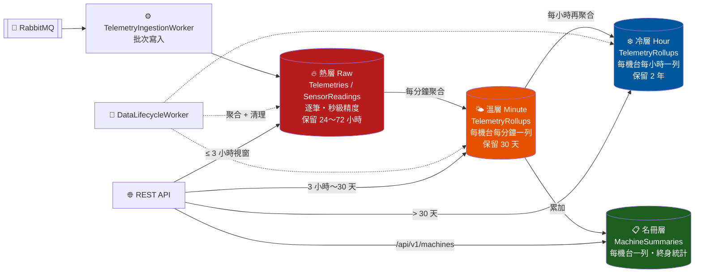
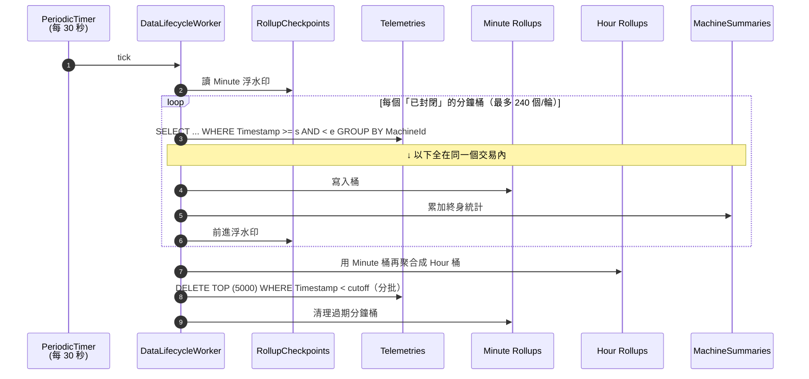

# 資料生命週期與冷熱分層（Data Lifecycle）

這份文件回答一個問題：**資料一直進來，怎麼讓系統十年後還跑得動？**

目前模擬器是 50 台機台、每台每秒一筆。現實中機台會更多、頻率會更高，而資料庫是唯一「只進不出」的元件 —— 它不會像 RabbitMQ 那樣消化完就清空。所以問題不是「會不會爆」，而是「哪一天爆、以什麼方式爆」。

> 📌 架構全貌請見 [ARCHITECTURE.md](./ARCHITECTURE.md)；日常操作請見 [OPERATIONS.md](./OPERATIONS.md)。

---

## 1. 先算清楚：現在的成長速度

| 項目 | 數量 |
|------|------|
| 機台數 | 50 台 |
| 每台頻率 | 1 筆/秒 |
| `Telemetries` 寫入 | 50 列/秒 = **432 萬列/天** |
| `SensorReadings` 寫入 | 100 列/秒（每筆寬表拆成溫度+壓力）= **864 萬列/天** |
| 合計 | 150 列/秒 = **1,296 萬列/天** |

加上索引空間，實際落到磁碟大約是 **每天 1.5～2 GB**。換算下來：

```
1 週  ≈  12 GB
1 個月 ≈  50 GB
1 年  ≈ 600 GB
```

### ⚠️ 最緊急的一件事：SQL Server Express 有 10 GB 硬上限

`docker-compose.yml` 目前設定 `MSSQL_PID: Express`。**Express 版單一資料庫上限 10 GB，這不是效能衰退，是硬牆** —— 撞到之後所有 `INSERT` 直接失敗：

```
Could not allocate space for object 'dbo.Telemetries' in database 'factory_iot'
because the 'PRIMARY' filegroup is full.
```

以現在的速度，**大約第 5～7 天就會撞牆**。Worker 會不斷重試 3 次然後印出 `CRITICAL: DATA LOSS`，而 RabbitMQ 佇列開始無限堆積。這是在談任何「分層設計」之前，先必須解決的問題。

### 另外三個藏在細節裡的問題

**（一）主鍵用隨機 GUID，而且它是叢集索引**

```csharp
public Guid Id { get; init; } = Guid.NewGuid();   // 隨機 v4 GUID
entity.HasKey(e => e.Id);                          // SQL Server 預設 = 叢集索引
```

叢集索引決定資料的**實體排列順序**。用隨機 GUID 當叢集鍵，等於每一筆新資料都插進資料表中間的隨機位置：

- **頁面分裂（page split）** —— 目標頁滿了就得對半切，是最貴的寫入行為之一
- **頁面填充率掉到 ~70%** —— 同樣的資料要多佔 40% 空間
- **緩衝池（buffer pool）被打爛** —— 寫入散佈全表，等於整張表都得留在記憶體裡；Express 的緩衝池上限只有 1.4 GB

這個問題**會隨資料量惡化**：表越大，隨機插入命中冷頁的機率越高。今天順暢不代表下個月順暢。

**（二）`/api/v1/machines` 是一顆定時炸彈**

```csharp
// 修改前：整張表 GROUP BY，沒有任何時間條件
_context.Telemetries.GroupBy(t => t.MachineId).Select(g => new { ... })
```

這條查詢**掃描歷史上每一列資料**，而前端儀表板**每 5 秒打一次**。第 1 天掃 432 萬列（還算快），第 30 天掃 1.3 億列。它不只自己慢，還會把整張表拉進緩衝池、把其他查詢的快取全部擠掉。

**在磁碟被塞滿之前，先掛掉的會是這條查詢。**

**（三）`SensorReadings` 是 100% 可重建的重複資料**

`SensorReading.FromTelemetry()` 只是把寬表拆開，沒有任何新資訊。但它佔了**全部寫入列數的 2/3**、也佔了同一筆交易 2/3 的 log 量。兩張表都用完整保留期，等於為零資訊量付兩倍成本。

---

## 2. 為什麼「冷熱兩張表」不是最好的解法

直覺的做法是：`Telemetries_Hot` 放最近 7 天、`Telemetries_Cold` 放歷史，定期搬家。但這個做法的效益其實有限：

| | 搬家式冷熱表 | 問題 |
|---|---|---|
| 總資料量 | **完全沒變** | 只是換個位置放，600 GB 還是 600 GB |
| 搬移成本 | 每列一次讀 + 一次寫 + 一次刪 | 比單純寫入還貴 |
| 儀表板查詢 | 24 小時視窗仍掃 432 萬列熱表 | 沒有解決最痛的問題 |
| Schema | 兩張同樣結構的表 | 每次改欄位要改兩次 |

**關鍵洞察：時序資料真正的槓桿不在「搬到哪」，而在「降解析度」。**

沒有人需要知道「EQP-001 在三個月前的星期二下午 2 點 37 分 14 秒是 68.3 °C」。需要的是「那天下午它的平均溫度、最高溫、有沒有出現 Warning」。而後者可以用 **1/60 到 1/3600 的空間**存下來，而且查詢速度快好幾個數量級。

這是 Prometheus、InfluxDB、TimescaleDB 全部採用的策略，我們用同樣的邏輯：**保留期分層（retention tiering）+ 預聚合（pre-aggregation）**。

> 真正還需要「冷資料表」的情境是**法規稽核**（必須保存原始逐筆資料好幾年）。那種需求應該匯出成 Parquet / CSV 丟到物件儲存，而不是留在 OLTP 資料庫裡 —— 見 §7。

---

## 3. 採用的架構：四層儲存



### 各層職責

| 層 | 資料表 | 內容 | 預設保留 | 每天列數（50 台） |
|----|--------|------|----------|-------------------|
| 🔥 **熱層** | `Telemetries` | 逐筆寬表快照，秒級精度 | 72 小時 | 432 萬 |
| 🔥 **熱層** | `SensorReadings` | 逐筆正規化讀值 | **24 小時** | 864 萬 |
| 🌤️ **溫層** | `TelemetryRollups`（Minute） | 每機台每分鐘：筆數 / min / max / **sum** | 30 天 | 7.2 萬 |
| ❄️ **冷層** | `TelemetryRollups`（Hour） | 每機台每小時，由溫層再聚合 | 2 年 | 1,200 |
| 🌤️❄️ | `TelemetryStatusRollups` | 每桶的狀態分佈（Running / Warning / …） | 同上 | 14.4 萬 / 2,400 |
| 📋 **名冊** | `MachineSummaries` | 每機台一列的終身累計 | 永久 | **50 列（固定）** |
| ⚙️ | `RollupCheckpoints` | 聚合進度浮水印 | 永久 | 2 列 |

### 為什麼存 `Sum` 而不是 `Avg`？

這是整個設計最容易做錯的地方。**平均值不能再聚合**：

```
第 1 分鐘：3 筆，都是 10 °C   → avg = 10
第 2 分鐘：1 筆，是   70 °C   → avg = 70

用平均值算小時平均： (10 + 70) / 2 = 40   ❌ 錯
用總和算小時平均：  (30 + 70) / 4 = 25   ✅ 對
```

只有在每個桶的筆數都一樣時，「平均的平均」才等於真平均 —— 而機台一漏傳就不成立了。所以溫層存 `SampleCount` + `SumTemperature`，冷層做 sum-of-sums，讀取時才除。這條規則在 `DataLifecycleRepositoryTests.BuildBucketAsync_Hour_ReAggregatesMinuteBucketsExactly` 有測試守著。

### `MachineSummaries`：把成長無上限的查詢變成固定成本

`/api/v1/machines` 現在讀一張**每機台一列**的維護表，而不是重算全表 GROUP BY：

- 修改前：掃描歷史上所有列，成本隨天數線性成長，**每 5 秒一次**
- 修改後：讀 50 列，**第 1000 天和第 1 天一樣快**

它由 lifecycle worker 在每個分鐘桶完成時**往前累加**（而非重算）。因此：

- ✅ 統計是**終身**的，不受保留期影響 —— 原始資料被清掉後，`MaxTemperature` 仍是這台機台史上最高溫（對機台名冊來說這才是想知道的答案）
- ⚠️ 累加不可逆，所以每個桶只能被計入一次 —— 靠 `RollupCheckpoints` 在**同一個交易**內保證

#### 名冊 + 即時尾巴：為什麼要疊第二層

名冊只到**最後一個封閉的分鐘桶**為止。桶要等 `RollupLagSeconds`（預設 120 秒）過後才算封閉，加上桶寬 1 分鐘與 worker 的 30 秒週期，名冊的 `LastSeen` 結構性地落後現在 **2～3.5 分鐘**。

對「這台機台跑得如何」沒差；對「這台機台現在還活著嗎」是錯的 —— 而前端正是拿 `LastSeen` 判斷即時燈號（門檻 30 秒）。名冊單獨供應時，**每台健康機台都會亮灰燈、都顯示「3 分前」**。

所以 `/api/v1/machines` 疊了一層即時尾巴：

```
        名冊（終身，落後 2～3 分鐘）        原始列（尾巴）
├────────────────────────────────────┤├──────────────────┤
0                              浮水印+1分鐘              now
                                    ↑
                     兩段的交界 —— 不重疊、也不留空隙
```

- **起點取自浮水印**：`RollupCheckpoints` 的下一個桶邊界之前都已經在名冊裡，從那裡開始接就不會重複計入
- **先讀名冊、後讀浮水印**：兩次讀取之間若剛好有一輪聚合 commit，那個桶會**兩邊都沒有**（下一次輪詢就補回來）。反過來讀則會**兩邊都有** —— 重複計入一個只能累加的總計是沒辦法回頭修的
- **寬度是聚合的落後量，不是資料庫的年齡**：健康時只有 2～3 分鐘的原始列，落在 `(Timestamp, Id)` 叢集索引的尾端幾頁，仍是範圍 seek
- **`RosterTailMinutes`（預設 15 分）是安全上限**：只有聚合停擺或關閉時才會生效。這時名冊的**總計會少算**沒被聚合的那段，但 `LastSeen` 仍然正確 —— 寧可回答得不完整，也不要在每次輪詢時掃一張無上限成長的表

順帶一提，這也讓 `DataRetention__Enabled=false`（完全關掉保留期）時機台總覽還能用：沒有浮水印就整段走 `RosterTailMinutes` 的視窗。

---

## 4. 熱層的實體結構修正

### 叢集鍵改成 `(Timestamp, Id)`

```csharp
entity.HasKey(e => new { e.Timestamp, e.Id });   // 取代原本的 HasKey(e => e.Id)
```

| | 修改前 `(Id)` 隨機 GUID | 修改後 `(Timestamp, Id)` |
|---|---|---|
| 寫入位置 | 全表隨機 | 永遠在**尾端追加** |
| 頁面分裂 | 大量 | 幾乎沒有 |
| 填充率 | ~70% | ~100% |
| 「清掉 3 天前」 | 全表掃描 + 隨機刪除 | **連續範圍刪除** |
| 「聚合某一分鐘」 | 全表掃描 | **範圍 seek** |

`Id` 留在鍵裡只是為了保證唯一性（同一台機台同一 tick 送兩筆時）。

> **為什麼不是 `(MachineId, Timestamp)`？** 因為頻率最高的兩個操作 —— 每分鐘聚合、每次清理 —— 都是「給我某個時間範圍的所有機台」，它們需要 Timestamp 當前導欄位。而「某台機台最新 N 筆」則由下面的涵蓋索引處理。

### 涵蓋索引（covering index）

```sql
CREATE NONCLUSTERED INDEX IX_Telemetries_MachineId_Timestamp
    ON Telemetries (MachineId ASC, Timestamp DESC)
    INCLUDE (Temperature, Pressure, Status)
    WITH (DATA_COMPRESSION = PAGE);
```

`INCLUDE` 讓「最新 N 筆」完全在索引葉層完成 —— seek 到機台、往下讀 N 列、直接拿到量測值，**完全不用回主表查找（key lookup）**。

### 頁面壓縮

三個欄位在同一頁內高度重複（機台代號、同一秒的時間戳、只有兩三種值的狀態字串），`DATA_COMPRESSION = PAGE` 通常能**壓到一半**。在 Express 的 10 GB 天花板下，這等於直接把可存放的歷史加倍。

> 資料壓縮從 SQL Server 2016 SP1 起**所有版本（含 Express）都支援**，不需要 Enterprise。

---

## 5. DataLifecycleWorker：怎麼運作



### 三個關鍵設計

**（1）一次處理一個桶，用明確的 `[start, end)` 範圍**

不用 `GROUP BY DATEADD(minute, DATEDIFF(...))`。桶的邊界在 C# 算好（`RollupBucket.Floor`），SQL 端只看到單純的範圍條件 —— 這樣查詢一定是索引 seek、一定能被任何 provider 翻譯，而且**追進度時天然是增量的**：每個桶各自 commit，斷線重連不會丟掉已完成的工作。

**（2）交易邊界 = 桶 + 名冊 + 浮水印**

三者在同一個交易裡。程序中途掛掉時，半完成的累加會連同浮水印一起 rollback，下一輪從頭重建這個桶 —— 不會被算「一次半」。這是名冊敢用「累加」而非「重算」的唯一理由。

**（3）清理的 cutoff 永遠被聚合進度夾住**

```csharp
var rawTelemetryCutoff = Earlier(now - RawTelemetryHours, minuteFrontier);
var minuteRollupCutoff = Earlier(now - MinuteRollupHours, hourFrontier);
```

如果聚合停擺，清理會**跟著停擺**，資料庫開始長大 —— 這是可以救回來的。反過來（清掉還沒被聚合的原始資料）則是不可逆的資料遺失。**寧可長大，不可刪錯。**

`SensorReadings` 不餵給任何一層（它只是寬表的另一種形狀，而寬表已經被聚合過了），所以它的 cutoff 不需要這個保護。

**（4）分批刪除**

一次刪掉一天的資料會鎖住表、把交易 log 撐爆。改成 `DELETE TOP (5000)` 迴圈，每輪最多 40 批。穩定狀態下每輪其實只需要 1～2 批（30 秒累積的量），剩下的預算是留給「縮短保留期後追進度」用的。

---

## 6. API 讀取路由

查詢會依**視窗寬度**自動選層：

| 視窗 | 讀哪一層 | 精度 | 掃描量（50 台） |
|------|----------|------|-----------------|
| ≤ 3 小時（`RawQueryWindowMinutes`） | 🔥 熱層原始列 | **秒級、即時** | 最多 54 萬列 |
| 3 小時 ～ 30 天 | 🌤️ Minute 桶 | 分鐘級，落後 1～2 分鐘 | 24 小時 = 7.2 萬列 |
| > 30 天 | ❄️ Hour 桶 | 小時級 | 1 年 = 43.8 萬列 |
| `/api/v1/machines` | 📋 名冊 **+ 🔥 熱層尾巴** | 終身累計，`LastSeen` **秒級即時** | 50 列 + 2～3 分鐘的原始列 |
| `/telemetry/{id}/latest`、`/sensors/{id}/readings` | 🔥 永遠熱層 | 逐筆原始 | seek + N 列 |

前端目前的四個預設視窗剛好落在正確的位置：

- **15 分 / 1 小時** → 熱層，完全即時（這是使用者盯著看的即時畫面）
- **6 小時 / 24 小時** → 溫層，掃描量降到 **1/60**（這兩個視窗原本是最貴的）

6 小時和 24 小時的圖表落後一兩分鐘，肉眼完全無感；但省下的是每 5 秒掃描 432 萬列。

### 效果對照

| 查詢 | 修改前 | 修改後 |
|------|--------|--------|
| `/api/v1/machines`（每 5 秒） | 掃描全表，**無上限成長** | 讀 50 列 + 2～3 分鐘的尾巴，固定成本 |
| `/fleet/status?windowMinutes=1440` | 掃 432 萬列 | 掃 7.2 萬列 |
| `/telemetry/{id}/stats?windowMinutes=1440` | 掃 8.6 萬列 | 掃 1,440 列 |
| 資料庫大小 | 每天 +1.5～2 GB，**永不停止** | **穩定在 ~2 GB** |

### 儲存量預估（穩定狀態）

| 層 | 列數 | 估計大小 |
|----|------|----------|
| `Telemetries`（72h） | 1,296 萬 | ~1.0 GB |
| `SensorReadings`（24h） | 864 萬 | ~0.7 GB |
| Minute 桶（30 天） | 216 萬 + 432 萬 | ~0.3 GB |
| Hour 桶（2 年） | 88 萬 + 175 萬 | ~0.13 GB |
| `MachineSummaries` | 50 | 可忽略 |
| **合計** | | **~2.2 GB，不再成長** |

在 Express 的 10 GB 上限下留了 4 倍餘裕（重建索引時需要暫存空間，不要貼著上限跑）。

---

## 7. 流量再往上長怎麼辦

設定值在 `appsettings.json` 的 `DataRetention` 區段，也可以用 `DataRetention__*` 環境變數覆寫（`docker-compose.yml` 已經列出主要幾個）。

### 500 台機台（10×，4,320 萬列/天）

先調參數：

```yaml
DataRetention__RawTelemetryHours: "12"      # 72 → 12
DataRetention__RawSensorReadingHours: "6"   # 24 → 6
DataRetention__RawQueryWindowMinutes: "60"  # 更早切到溫層
```

→ 熱層約 1.7 GB，總量約 3 GB，Express 還撐得住。同時要做的：

1. **把 `MSSQL_PID` 從 `Express` 改成 `Developer`**（本機開發免費、無大小限制）或正式環境用 Standard
2. **認真考慮砍掉 `SensorReadings`** —— 它佔 2/3 的寫入量卻沒有新資訊。兩個誠實的選項：
   - 保持極短保留期（目前的預設做法）
   - 或讓 `/api/v1/sensors/...` 直接對 `Telemetries` 做 `UNPIVOT`，把這張表整個拿掉
3. **把批次寫入換成 `SqlBulkCopy`** —— EF Core 的 `AddRange` + `SaveChanges` 會產生多條參數化 INSERT，`SqlBulkCopy` 大約快一個數量級、log 量也小得多

### 5,000 台機台（100×，4.3 億列/天）

單靠參數調整不夠了，需要架構性的改變。依投資報酬率排序：

**① 時間分割表（Table Partitioning）+ 滑動視窗**

清理從「分批 DELETE」變成 `SWITCH OUT` + `DROP`，是**純 metadata 操作 —— 毫秒級、幾乎不寫 log**：

```sql
CREATE PARTITION FUNCTION pf_TelemetryDaily (datetimeoffset)
    AS RANGE RIGHT FOR VALUES ('2026-07-27T00:00:00Z', '2026-07-28T00:00:00Z', ...);

CREATE PARTITION SCHEME ps_TelemetryDaily
    AS PARTITION pf_TelemetryDaily ALL TO ([PRIMARY]);

-- 叢集鍵已經是 (Timestamp, Id)，所以可以直接對齊分割
ALTER TABLE Telemetries DROP CONSTRAINT PK_Telemetries;
ALTER TABLE Telemetries ADD CONSTRAINT PK_Telemetries
    PRIMARY KEY CLUSTERED (Timestamp, Id) ON ps_TelemetryDaily(Timestamp);

-- 清理一天的資料 = 換出去再丟掉
ALTER TABLE Telemetries SWITCH PARTITION 1 TO Telemetries_Staging;
TRUNCATE TABLE Telemetries_Staging;
```

**本次的叢集鍵修正正是為此鋪路** —— 分割欄位必須在叢集鍵和所有唯一索引裡，`(Timestamp, Id)` 已經滿足。另外需要一個維護工作定期 `SPLIT` 出未來的分割區。分割表從 SQL Server 2016 SP1 起所有版本都支援。

**② 冷層改用叢集式資料行存放區（Clustered Columnstore）**

聚合資料是欄位式儲存的最佳案例，**通常有 10 倍壓縮**，而且 `GROUP BY` 掃描快好幾倍：

```sql
CREATE CLUSTERED COLUMNSTORE INDEX CCI_TelemetryRollups
    ON TelemetryRollups WITH (DROP_EXISTING = ON);
```

同樣從 2016 SP1 起 Express 也支援。適合套在 Hour 層（很少更新、只做範圍聚合）。

**③ 讀寫分離**

儀表板的查詢和攝取寫入搶同一個緩衝池。把讀取導到 Always On 唯讀副本，或把溫/冷層搬到獨立的分析資料庫。

**④ 換成專用的時序資料庫**

到這個量級，關聯式資料庫是在做它不擅長的事：

| 方案 | 適合的情境 | 代價 |
|------|-----------|------|
| **TimescaleDB**（PostgreSQL 擴充） | 想留住 SQL 和關聯式模型 | 換資料庫；但 hypertable + continuous aggregate 本質上就是本文件手工做的這套，變成內建 |
| **ClickHouse** | 分析查詢為主、寫入極高 | 不適合逐筆點查；營運複雜度較高 |
| **InfluxDB / VictoriaMetrics** | 純指標、標籤式模型 | 資料模型限制較多 |

**判斷標準**：如果本文件的分層設計已經需要你手寫分割維護、columnstore 管理、跨層 UNION 查詢 —— 那就是該換的訊號了。在那之前，SQL Server 加上這套分層完全撐得住。

---

## 8. 維運

### 觀察什麼

新增的 Prometheus 指標：

| 指標 | 型別 | 意義 |
|------|------|------|
| `telemetry_rollup_lag_seconds{granularity}` | Gauge | **最重要的一個** —— 聚合落後現在多少秒 |
| `telemetry_rollup_buckets_total{granularity}` | Counter | 已建立的桶數 |
| `telemetry_rollup_rows_total{granularity}` | Counter | 已寫入的聚合列數 |
| `telemetry_rows_purged_total{tier}` | Counter | 各層清理掉的列數 |
| `telemetry_channel_depth` | Gauge | 記憶體緩衝中待寫入的訊息數 |

**健康的系統：**

- `telemetry_rollup_lag_seconds{granularity="Minute"}` 穩定在 **120～180 秒**之間（= 120 秒安全邊際 + 最多一個桶寬；Prometheus 剛好在兩輪之間抓到時，最多再多一個排程間隔）。**持續往上爬 = 聚合跟不上攝取**，此時清理已自動停止，資料庫會開始長大。
- `telemetry_rows_purged_total` 穩定成長 = 保留期有在生效。**一直是 0** 表示還沒有資料老到需要清（前 72 小時正常），或者 worker 沒在跑。
- `telemetry_channel_depth` 應該貼近 0。**持續偏高 = 資料庫寫入跟不上**。

### 直接查狀態

```bash
curl -s http://localhost:8080/api/v1/data-lifecycle | jq
```

回傳每一層目前保有的資料範圍、聚合浮水印、落後秒數與設定中的保留期。**資料庫長大得不合預期時，先看這支。**

這支端點刻意**不做 `COUNT(*)`** —— 對熱層算列數要讀過每一頁，正是這套設計要消滅的存取模式。它回報的是「最舊 / 最新一列的時間」，那是叢集索引上的單次 seek。

### 手動驗證清理有在動（需要真實的 SQL Server）

分批刪除走的是 provider 專屬的 `DELETE TOP (n)`，in-memory provider 跑不了，所以自動測試沒有涵蓋。要驗證的話：

```sql
-- 熱層最舊的資料應該貼齊 RawTelemetryHours
SELECT MIN([Timestamp]) AS Oldest, MAX([Timestamp]) AS Newest FROM [Telemetries];

-- 分鐘桶應該持續往前推進
SELECT TOP 5 * FROM [TelemetryRollups] WHERE [Granularity] = 1 ORDER BY [BucketStart] DESC;

-- 浮水印（1 = Minute，2 = Hour）
SELECT * FROM [RollupCheckpoints];

-- 實際佔用空間
EXEC sp_spaceused N'Telemetries';
EXEC sp_spaceused N'TelemetryRollups';
```

### 套用這次的變更

`Program.cs` 在啟動時自動跑 migration，所以 `docker-compose up` 就會套用。但要注意：

> ⚠️ **`TieredStorage` migration 會重建 `Telemetries` 和 `SensorReadings` 的叢集索引。**
> 空資料庫上是瞬間完成。已經有資料的資料庫上，這是一次**離線重建**（Express 不支援線上重建索引），時間與表大小成正比，而且排序期間需要相當於最大表大小的可用空間。已經跑了一陣子的話，請安排維護時間 —— 或者，如果現有資料只是測試資料，直接 `docker-compose down -v` 重來最快。

Migration 也會把既有資料**回填**進 `MachineSummaries`（一次性的全表 GROUP BY），並把聚合浮水印設在目前最新的一筆，讓升級後的機台名冊不會有空窗期。

### 調整保留期

改 `docker-compose.yml` 的環境變數再重啟即可，不需要 migration：

```yaml
DataRetention__RawTelemetryHours: "72"        # 熱層原始遙測
DataRetention__RawSensorReadingHours: "24"    # 熱層正規化讀值
DataRetention__MinuteRollupHours: "720"       # 分鐘桶 = 30 天
DataRetention__HourRollupHours: "17520"       # 小時桶 = 2 年
```

**縮短**保留期會在下一輪立刻開始刪資料（受每輪批次上限節流，會分幾輪追完）。**拉長**保留期只影響之後的資料 —— 已經刪掉的救不回來。

`DataRetention__Enabled: "false"` 可以完全關掉 worker（除錯用）。**關著就等於回到資料無限成長的狀態。**

---

## 9. 這次改了什麼

| 檔案 | 變更 |
|------|------|
| `FactoryIoTDbContext.cs` | 叢集鍵改成 `(Timestamp, Id)`；涵蓋索引；四張新表 |
| `Migrations/…_TieredStorage.cs` | 重建索引 + 頁面壓縮 + 建表 + 回填名冊與浮水印 |
| `Entities/TelemetryRollup.cs` 等 | 聚合桶、狀態桶、浮水印、機台名冊 |
| `DataLifecycleRepository.cs` | 逐桶聚合、名冊累加、分批清理、狀態報告 |
| `DataLifecycleWorker.cs` | 排程、追進度預算、cutoff 夾制、指標 |
| `TelemetryRepository.cs` | 依視窗寬度選層；名冊查詢取代全表 GROUP BY，並疊加尚未聚合的原始列讓 `LastSeen` 即時 |
| `TelemetryIngestionWorker.cs` | Channel 改為有界，滿了就對 RabbitMQ 施加背壓 |
| `Program.cs` | 註冊設定與 worker；新增 `/api/v1/data-lifecycle` |
| `appsettings.json` / `docker-compose.yml` | `DataRetention` 設定區段 |

### 順帶修掉的一個風險：無界的記憶體緩衝

```csharp
// 修改前：Channel.CreateUnbounded<Telemetry>(...)
// 修改後：
Channel.CreateBounded<Telemetry>(new BoundedChannelOptions(20_000)
{
    FullMode = BoundedChannelFullMode.Wait,
});
```

原本資料庫一慢下來，訊息就在記憶體裡無限堆積直到 OOM —— 而且被 OOM kill 時，堆在裡面的資料全部消失。改成有界之後，滿了會**卡住 consumer callback（在 ack 之前）**，未確認訊息累積到 prefetch 上限，broker 停止推送，backlog 留在 **RabbitMQ 這個持久化的地方**等待。

這正是既有架構文件裡「用 RabbitMQ 當緩衝」那個決策原本想要的行為。

---

## 10. 已知取捨

誠實列出這個設計換來了什麼：

1. **超過 3 小時的視窗有 1～2 分鐘的落後。** 聚合只處理已封閉且過了安全邊際的桶，因為在 RabbitMQ 或 channel 裡還沒落地的資料如果被算進去，那個桶就永遠是不完整的（沒有任何機制會回頭重算）。需要秒級即時就查 3 小時以內的視窗。

2. **超過保留期就回不去逐筆資料。** 三天前的資料只剩分鐘級聚合。要保留原始逐筆資料多年，需要 §7 的匯出封存方案。

3. **`MachineSummaries` 是終身統計，不受保留期影響。** min/max 本來就無法「反累加」；對機台名冊來說「史上最高溫」比「還留著的資料裡的最高溫」更有意義。但這也代表**手動倒轉浮水印時必須同時清空這張表**，否則重播的桶會被重複計入。

4. **清理走 `DELETE` 而非分割區切換。** 在目前的量級下綽綽有餘（穩定狀態每 30 秒只需刪約 1,500 列），但這是流量成長時第一個該升級的地方 —— §7 已經備好 SQL。

5. **清理的自動化測試沒有涵蓋。** `DELETE TOP (n)` 是 SQL Server 專屬語法，in-memory provider 執行不了。聚合邏輯有完整測試；清理請用 §8 的手動查詢驗證。
