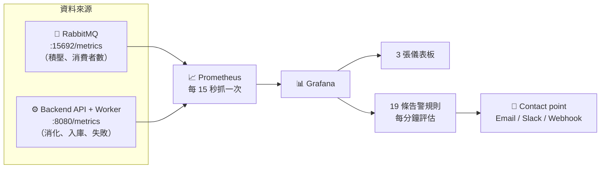

# 監控與告警手冊（Monitoring & Alerting）

這份文件說明「MQ 開始累積、Worker 沒在消化」這類問題**怎麼被自動看見、自動告警**。

儀表板與告警規則全部是 **provisioning 進去的** —— `docker compose up -d` 之後打開
Grafana 就已經在那裡了，不需要手動加資料來源、不需要自己拉圖表、不需要在 UI 裡建告警。

> 📐 系統架構請看 [ARCHITECTURE.md](./ARCHITECTURE.md)｜日常操作請看 [OPERATIONS.md](./OPERATIONS.md)

---

## 目錄

1. [30 秒版：我該看哪裡](#1-30-秒版我該看哪裡)
2. [監控資料是怎麼串起來的](#2-監控資料是怎麼串起來的)
3. [三張儀表板](#3-三張儀表板)
4. [19 條告警規則](#4-19-條告警規則)
5. [怎麼調門檻](#5-怎麼調門檻)
6. [怎麼收到通知（Email / Slack / Webhook）](#6-怎麼收到通知email--slack--webhook)
7. [實際演練：把積壓做出來，看告警燒起來](#7-實際演練把積壓做出來看告警燒起來)
8. [判讀速查表：看到這個現象 → 代表什麼](#8-判讀速查表看到這個現象--代表什麼)
9. [指標清單](#9-指標清單)
10. [疑難排解](#10-疑難排解)

---

## 1. 30 秒版：我該看哪裡

```bash
docker compose up -d
```

打開 **http://localhost:3000**（`admin` / `admin`）。登入後**直接就是**〈① MQ 積壓與 Worker 消化〉。

最上面那排四個方塊就是全部的重點：

| 方塊 | 正常長相 | 不正常代表什麼 |
|------|----------|----------------|
| **佇列積壓 (Ready)** | 接近 0，綠色 | 一路往上 = MQ 在累積 |
| **處理中 (Unacked)** | 0～500 之間浮動 | 貼死在 500 = Worker 收了卻卡住 |
| **Worker 消費者數** | ≥ 1，綠色 | **0 = Worker 根本沒接上，只進不出** |
| **Worker 健康狀態** | 綠底「正常」 | 紅底「異常」= 沒連上 MQ 或批次處理停擺 |

告警在 **Alerting → Alert rules**，同時也直接顯示在儀表板中間的〈🔔 目前告警〉面板上。

---

## 2. 監控資料是怎麼串起來的



**關鍵在於兩個資料來源缺一不可：**

- `telemetry_*`（來自 Worker）只知道**它消化了多少**。Worker 完全停擺時，這些數字就只是不動 ——
  跟「工廠今天沒開工」長得一模一樣，光看它分不出是故障還是沒事。
- `rabbitmq_*`（來自 broker）才知道**還有多少在排隊、有沒有人在消費**。

> ⚠️ 這正是原本這套系統看不到積壓的原因：Prometheus 只抓 `backend-api`，沒有抓 RabbitMQ。
> 現在 `prometheus.yml` 多了 `rabbitmq` 這個 job，`rabbitmq.conf` 也打開了
> `prometheus.return_per_object_metrics = true`，指標才會帶上 `queue` 標籤、能分佇列看。

---

## 3. 三張儀表板

檔案在 `grafana/dashboards/`，Grafana 裡放在 **Factory IoT** 資料夾。

### ① MQ 積壓與 Worker 消化 `10-mq-ingestion-pipeline.json`

**主控台，出事先看這張。** 分成四區：

**🚨 現況總覽**（8 個數字方塊）
佇列積壓、處理中、消費者數、Worker 健康、消化速率、入庫速率、淨積壓變化、預估清空時間。

其中兩個值得特別說明：

- **淨積壓變化** = 發布速率 − 消化速率。> 0 就是每秒補不回來的量；≤ 0 代表正在追回積壓。
- **預估清空時間** = 現有積壓 ÷ 淨消化速度。消化長期慢於發布時永遠清不完，會直接顯示
  **「⚠ 追不上，持續積壓」**。

**📈 積壓趨勢**

- **佇列深度：待處理 vs 處理中** —— 堆疊面積圖，虛線是告警門檻（1000 / 10000）。
- **發布 vs 消化 vs 入庫** —— 整條管線三個關卡的每秒速率。**這張圖是找瓶頸的主力**：
  健康時三條線幾乎重疊；哪兩條開始分岔，瓶頸就在那一段。
- **積壓成長率** —— 佇列深度的斜率。絕對量還沒超標、但方向已經不對時，這裡先看得出來。
- **🔔 目前告警** —— 所有 firing / pending 的告警直接列在這裡。

**⚙️ Worker 消化端**

- **Worker 內部緩衝深度** —— 已從 MQ 取出、但還沒寫進 DB 的筆數。
- **批次寫入延遲（P50/P95/P99）** —— 虛線 2 秒 = 批次觸發間隔。
- **寫入失敗與訊息重送** —— 兩條都應該恆為 0。
- **停滯時間** —— 距離上次收到訊息 / 上次入庫幾秒。

### ② RabbitMQ Broker 健康 `20-rabbitmq-broker.json`

broker 本身：連線 / 通道 / 消費者 / 佇列數、**三個資源水位警報**（記憶體、磁碟、fd —— 這三個
一旦觸發，RabbitMQ 會直接擋住發布端）、所有佇列的快照表格、節點資源趨勢。

### ③ API 與資料庫寫入 `30-api-and-database.json`

REST API 的請求速率 / 5xx / 延遲分位數，以及落地端：兩張表的寫入速率、累計已消化 vs 已入庫
（兩條線的落差就是還卡在記憶體裡沒落地的量）、批次延遲、每秒批次數。

> 儀表板是唯讀的（provisioning 的東西在 UI 上不能存檔）。想自己改：
> **Dashboard settings → Save as...** 複製一份，或直接改 `grafana/dashboards/*.json`
> —— 存檔後 30 秒內 Grafana 會自動重新載入，連重啟都不用。

---

## 4. 19 條告警規則

規則檔在 `grafana/provisioning/alerting/`，分成三組。所有規則都帶
`service=factory-iot` 標籤（儀表板的告警面板就是靠它篩選）。

### 🔴 組一：佇列積壓 `rules-mq-backlog.yml`

| 告警 | 條件 | 持續 | 嚴重度 |
|------|------|------|--------|
| MQ 積壓警戒 | Ready > 1000 | 5m | warning |
| MQ 積壓嚴重 | Ready > 10000 | 5m | critical |
| **佇列沒有任何消費者** | `rabbitmq_queue_consumers` < 1 | 2m | critical |
| **有積壓但完全沒有消化** | Ready > 200 **且** 消化速率 < 0.1/s | 3m | critical |
| 積壓持續成長 | 15 分鐘斜率 > 1 筆/秒 | 15m | warning |
| 消化速率追不上發布速率 | 發布 − 消化 > 5 筆/秒 | 10m | warning |
| 訊息重送率偏高 | 重送 > 1 筆/秒 | 5m | warning |

中間兩條粗體的就是你要的那個情境。它們刻意分開，因為根因不同：

- **「沒有任何消費者」** = Worker 連都沒連上（容器沒起來、`ACCESS_REFUSED`、連線設定錯）。
- **「有積壓但完全沒有消化」** = consumer 還掛著，但卡住不吃了（批次迴圈卡在資料庫、
  prefetch 滿了卻沒人 ack）。

### 🟠 組二：Worker 消化與入庫 `rules-worker-health.yml`

| 告警 | 條件 | 持續 | 嚴重度 |
|------|------|------|--------|
| Worker 不健康 | `telemetry_worker_healthy` < 1 | 2m | critical |
| Worker 太久沒收到訊息 | 距上次收訊息 > 300s | 2m | warning |
| 有消化但沒有入庫 | 消化 > 0.1/s **且** 入庫 < 0.01/s | 5m | critical |
| **批次寫入失敗（資料遺失）** | 10 分鐘內 `telemetry_failed_total` 有增加 | 1m | critical |
| 批次寫入延遲過高 | P95 > 2s | 10m | warning |
| Worker 內部緩衝暴增 | 緩衝 > 5000 筆 | 5m | warning |

### 🔵 組三：服務與 Broker 可用性 `rules-platform-health.yml`

| 告警 | 條件 | 持續 | 嚴重度 |
|------|------|------|--------|
| RabbitMQ 指標抓不到 | `up{job="rabbitmq"}` < 1 | 2m | critical |
| Backend API 指標抓不到 | `up{job="backend-api"}` < 1 | 2m | critical |
| RabbitMQ 記憶體水位警報 | alarm = 1 | 1m | critical |
| RabbitMQ 磁碟空間警報 | alarm = 1 | 1m | critical |
| RabbitMQ 檔案描述符警報 | alarm = 1 | 1m | warning |
| API 5xx 錯誤率偏高 | > 0.05 次/秒 | 5m | warning |

### 每條告警都附「處理步驟」

在 Grafana 點進任何一條告警，`runbook` 標註裡有具體的下一步指令，例如：

> 1) 先看『佇列沒有任何消費者』有沒有一起燒 → 有的話是 Worker 沒接上。
> 2) `curl http://localhost:8080/health/worker` 看 isHealthy。
> 3) 看儀表板〈發布 vs 消化 vs 入庫〉三條線是不是分岔 —— 分岔點就是瓶頸所在。

### 為什麼一次故障不會噴出十幾封通知

大部分規則的 `noDataState` 設成 **OK**：服務整個掛掉、指標直接消失時，那些規則會安靜下來，
改由 `fiot-rabbitmq-down` / `fiot-backend-down`（`noDataState: Alerting`）這兩條兜底。
再加上 notification policy 以 `alertname` 分組，同一條規則的多個 instance 會併成一封。

---

## 5. 怎麼調門檻

門檻是照這套系統的實際流量抓的：**50 台機台 × 每秒 1 筆 ≈ 50 筆/秒**。
換算成「積了幾秒的產量」比較好抓感覺：

| 門檻 | 換算 | 為什麼是這個數字 |
|------|------|------------------|
| Ready > 1000 | 約 20 秒產量 | 短暫尖峰不會碰到；真的塞住才會連續 5 分鐘超過 |
| Ready > 10000 | 約 3.3 分鐘產量 | 再上去記憶體/磁碟水位警報就要跟著燒了 |
| 淨積壓 > 5 筆/秒 | 產量的 10% | 補不回來的量，長期一定累積 |
| 批次延遲 P95 > 2s | = 批次觸發間隔 | 超過就代表上一批還沒寫完下一批就到了 |
| 緩衝 > 5000 筆 | 約 100 秒產量 | 這些資料只在記憶體裡，重啟就沒了 |

**機台數量改了，門檻要跟著改。** 每條規則的三段結構都一樣：

```
A = PromQL 查詢（instant） → B = 取最後一個值 → C = 比門檻
```

所以門檻永遠在該規則 `data` 陣列最後一段（`refId: C`）的：

```yaml
conditions:
  - evaluator:
      params: [1000]   # ← 改這裡
      type: gt
```

「要撐多久才真的燒起來」則是規則層級的 `for:`。改完：

```bash
docker compose restart grafana
```

---

## 6. 怎麼收到通知（Email / Slack / Webhook）

**先說清楚：不設定也會運作。** 所有告警一律會在 Grafana 的 Alerting 頁面與儀表板的
〈🔔 目前告警〉面板亮起。這一節只決定要不要**主動推播出去**。

預設路由（`notification-policies.yml`）：

- 全部告警 → `factory-iot-default`
- `severity=critical` → `factory-iot-critical`（等待更短、每小時重複提醒）

### Email

在專案根目錄放一個 `.env`：

```bash
GF_SMTP_ENABLED=true
GF_SMTP_HOST=smtp.gmail.com:587
GF_SMTP_USER=you@gmail.com
GF_SMTP_PASSWORD=<應用程式密碼>
GF_SMTP_FROM_ADDRESS=you@gmail.com
```

再把 `grafana/provisioning/alerting/contact-points.yml` 裡的 `addresses:` 換成你的信箱，
然後 `docker compose restart grafana`。

### Slack

`contact-points.yml` 裡已經備好註解掉的區塊，解開並填入 Incoming Webhook URL：

```yaml
  - orgId: 1
    name: factory-iot-slack
    receivers:
      - uid: factory-iot-slack-webhook
        type: slack
        settings:
          url: https://hooks.slack.com/services/XXX/YYY/ZZZ
```

再把 `notification-policies.yml` 裡的 `receiver:` 改成 `factory-iot-slack`，重啟 Grafana。

> ⚠️ Grafana 的**告警** provisioning 不會展開環境變數（`${VAR}` 會被當成字面字串），
> 所以這幾個檔案裡的值必須直接寫死。也因為是 provisioning 進來的，UI 上是唯讀的。

---

## 7. 實際演練：把積壓做出來，看告警燒起來

這是驗證整套監控真的有效最快的方法 —— 直接把 Worker 關掉，模擬「MQ 一直累積、
沒人消化」：

```bash
# 0. 先確認一切正常
docker compose up -d
curl -s http://localhost:15692/metrics | grep 'rabbitmq_queue_consumers{'
#   應該看到 ...queue="telemetry-queue"} 1

# 1. 把消化端關掉，模擬 Worker 掛了（simulator 繼續發）
docker compose stop backend-api

# 2. 打開 http://localhost:3000 盯著第一張儀表板
```

**接著會依序看到：**

| 時間 | 現象 |
|------|------|
| ~0s | 「Worker 消費者數」變 **0**，紅色，顯示「0 · 沒人在消化」 |
| ~15s | 「佇列積壓 (Ready)」開始一路往上，〈佇列深度〉圖表爬升 |
| ~30s | 〈發布 vs 消化 vs 入庫〉三條線分岔：發布還在 50/s，另外兩條掉到 0 |
| ~1min | 「預估清空時間」變成 **「⚠ 追不上，持續積壓」** |
| **2min** | 🔴 **佇列沒有任何消費者**、**Backend API 指標抓不到** 開始燒 |
| **3min** | 🔴 **有積壓但完全沒有消化** 開始燒 |
| ~20s 後（積壓破 1000） + 5min | 🟠 **MQ 積壓警戒** 開始燒 |

告警會出現在儀表板的〈🔔 目前告警〉面板，以及 **Alerting → Alert rules**。

**恢復：**

```bash
docker compose start backend-api
```

Worker 會重新接上、開始追積壓（消化速率會暫時衝到遠高於 50/s，因為 prefetch 是 500）。
積壓歸零後，所有告警會在幾分鐘內自動轉回 Normal。

> 想順便看看資料庫變成瓶頸長什麼樣：`docker compose stop mssql`。這時消費者數還是 1、
> MQ 也不太積（Worker 照吃），但〈Worker 內部緩衝深度〉會一路衝高，
> 然後「有消化但沒有入庫」燒起來 —— 兩種故障的訊號完全不同。

---

## 8. 判讀速查表：看到這個現象 → 代表什麼

| Ready 積壓 | Unacked | 消費者數 | 內部緩衝 | 診斷 |
|-----------|---------|---------|---------|------|
| 0 | 0 | ≥1 | 0 | ✅ 一切正常 |
| ⬆ 上升 | 0 | **0** | 0 | ❌ **Worker 沒接上 MQ** — 看 backend-api 容器與 log |
| ⬆ 上升 | 貼著 500 | ≥1 | 0 | ❌ consumer 收得到但處理不完 —— 卡在下游 |
| ⬆ 上升 | 正常浮動 | ≥1 | ⬆ 上升 | ❌ **資料庫寫不進去** —— 資料堆在記憶體，別重啟容器 |
| 平穩偏高 | 正常 | ≥1 | 0 | ⚠️ 容量不足，消化長期略慢於發布 |
| 0 | 0 | ≥1 | 0，但收不到訊息 | ℹ️ 上游沒在發（simulator 停了），不是故障 |

---

## 9. 指標清單

### 來自 RabbitMQ（`rabbitmq:15692/metrics`）

| 指標 | 說明 |
|------|------|
| `rabbitmq_queue_messages_ready{queue}` | **待處理訊息數 —— 積壓的定義** |
| `rabbitmq_queue_messages_unacked{queue}` | 已投遞但未 ack |
| `rabbitmq_queue_consumers{queue}` | **掛在佇列上的消費者數，0 = 沒人在消化** |
| `rabbitmq_queue_messages_published_total{queue}` | 累計發布數（取 rate 得發布速率） |
| `rabbitmq_channel_messages_acked_total{queue}` | 累計 ack 數 |
| `rabbitmq_channel_messages_redelivered_total{queue}` | 累計重送數 |
| `rabbitmq_alarms_*_watermark` / `_limit` | 記憶體 / 磁碟 / fd 水位警報（1 = 已觸發） |
| `rabbitmq_connections` · `_channels` · `_consumers` · `_queues` | broker 總量 |

### 來自 Backend API（`backend-api:8080/metrics`）

| 指標 | 說明 |
|------|------|
| `telemetry_consumed_total` | 累計從 MQ 消化的訊息數 |
| `telemetry_written_total` | 累計寫入 `Telemetries` 的筆數 |
| `sensor_readings_written_total` | 累計寫入 `SensorReadings` 的筆數 |
| `telemetry_failed_total` | 重試 3 次仍失敗（**代表資料已遺失**） |
| `telemetry_batch_processing_seconds` | 批次寫入耗時（histogram） |
| `telemetry_worker_healthy` | 🆕 1 = 已連上 MQ 且批次處理在跑 |
| `telemetry_worker_buffer_depth` | 🆕 已消化但還沒入庫的記憶體緩衝深度 |
| `telemetry_worker_last_message_timestamp_seconds` | 🆕 上次收到訊息的 Unix 時間 |
| `telemetry_worker_last_flush_timestamp_seconds` | 🆕 上次成功入庫的 Unix 時間 |
| `http_requests_received_total` · `http_request_duration_seconds` | REST API（prometheus-net 自動產生） |

> 🆕 標記的四個是為了讓「Worker 有沒有在消化」可以被直接告警而新增的。
> 原本的計數器停止增長時，跟「工廠沒開工」長得一模一樣，分不出來。

---

## 10. 疑難排解

### 儀表板全部是「No data」

```bash
# 1. Prometheus 有沒有抓到兩個 target
open http://localhost:9090/targets     # rabbitmq 與 backend-api 都要是 UP

# 2. RabbitMQ 的 metrics 端點通不通
curl -s http://localhost:15692/metrics | head

# 3. 指標有沒有帶 queue 標籤（沒有的話是 rabbitmq.conf 沒掛進去）
curl -s http://localhost:15692/metrics | grep 'rabbitmq_queue_messages_ready'
#   要看到：rabbitmq_queue_messages_ready{vhost="/",queue="telemetry-queue"} 0
#   若看到沒有標籤的：rabbitmq_queue_messages_ready 0
#   → prometheus.return_per_object_metrics 沒生效，確認 rabbitmq.conf 有被掛載
docker compose exec rabbitmq cat /etc/rabbitmq/conf.d/20-factory-iot.conf
```

### `rabbitmq_queue_*` 完全查不到 / 左上角「佇列」下拉是空的

佇列要有人宣告過才存在，所以整套剛啟動、simulator 還沒發出第一筆時，
`rabbitmq_queue_*` 這些指標本來就不存在。儀表板左上角的「佇列」變數是靠
`label_values(rabbitmq_queue_messages_ready, queue)` 生出來的，這時候會是空的，
所有面板跟著沒資料。

確認 simulator 有在跑，然後**重新整理一次頁面**（變數只在載入儀表板時查詢）：

```bash
docker compose logs simulator | head -20
```

### 儀表板 / 告警沒有出現在 Grafana

```bash
docker compose logs grafana | grep -i "provisioning\|alerting\|error"
```

Provisioning 檔案有語法錯誤時 Grafana 會在啟動 log 裡指出是哪個檔案哪一行。

### 我在 UI 改了圖表卻存不起來

正常。Provisioning 進來的儀表板與告警在 UI 上都是唯讀的。
改 `grafana/` 底下的檔案 → 儀表板 30 秒內自動生效，告警與資料來源要
`docker compose restart grafana`。

### 想從乾淨狀態重來

```bash
docker compose down -v && docker compose up -d
```
