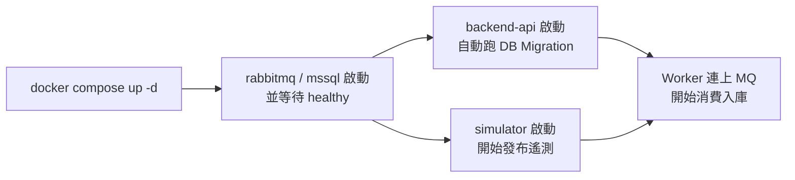

# 操作手冊（Operations Manual）

這份手冊帶你從零把整套系統跑起來、確認每個環節都正常、看懂監控，以及在出問題時該怎麼查。照著步驟走即可，不需要先讀懂程式碼。

> 📐 想了解系統怎麼設計的，請看 [架構文件 ARCHITECTURE.md](./ARCHITECTURE.md)。

---

## 目錄

1. [前置需求](#1-前置需求)
2. [一鍵啟動](#2-一鍵啟動)
3. [服務清單與存取資訊](#3-服務清單與存取資訊)
4. [啟動後驗證（Health Check）](#4-啟動後驗證health-check)
5. [常用操作](#5-常用操作)
6. [設定 Grafana 監控](#6-設定-grafana-監控)
7. [執行 k6 壓力測試](#7-執行-k6-壓力測試)
8. [查詢資料庫](#8-查詢資料庫)
9. [故障排除](#9-故障排除)
10. [停止與清理](#10-停止與清理)
11. [設定參數速查](#11-設定參數速查)

---

## 1. 前置需求

| 工具 | 必要性 | 說明 |
|------|--------|------|
| Docker & Docker Compose | ✅ 必要 | 執行整套系統 |
| k6 | 選用 | API 壓力測試（也可用 Docker 版，免安裝） |
| SSMS / Azure Data Studio | 選用 | 圖形化查詢 SQL Server |
| curl | 建議 | 快速驗證 API |

確認 Docker 已啟動：

```bash
docker --version
docker compose version
```

---

## 2. 一鍵啟動

在專案根目錄執行：

```bash
docker compose up -d
```

> 💡 首次執行會 build `backend-api` 與 `simulator` 映像檔並下載基礎映像，可能需要數分鐘。之後啟動約 30–60 秒。

啟動流程（自動化，無需人工介入）：



查看所有容器狀態：

```bash
docker compose ps
```

理想狀態下 6 個容器都應該是 `Up`（`rabbitmq`、`mssql` 會標示 `healthy`）。

---

## 3. 服務清單與存取資訊

| 服務 | 網址 / 位置 | 帳號 | 密碼 |
|------|-------------|------|------|
| Backend API — Health | http://localhost:8080/health | — | — |
| Backend API — Swagger（開發用） | http://localhost:8080/swagger | — | — |
| Backend API — Metrics | http://localhost:8080/metrics | — | — |
| RabbitMQ 管理 UI | http://localhost:15672 | `guest` | `guest` |
| SQL Server | `localhost,1433` | `sa` | `IoT_Secret123!` |
| Prometheus | http://localhost:9090 | — | — |
| Grafana | http://localhost:3000 | `admin` | `admin` |

> ⚠️ 以上帳密僅供本機開發用，**切勿用於正式環境**。

### API 端點一覽

| 方法 | 路徑 | 說明 |
|------|------|------|
| GET | `/health` | 基本存活檢查，回 `{ "status": "healthy" }` |
| GET | `/health/worker` | Worker 詳細狀態；不健康時回 **HTTP 503** |
| GET | `/api/v1/telemetry/{machineId}/latest?count=N` | 查某台機台最新 N 筆寬表快照（`count` 需 1–100） |
| GET | `/api/v1/sensors/{machineId}/readings?count=N&sensorType=` | 查某台機台最新 N 筆正規化感測讀值，可用 `sensorType`（Temperature／Pressure）篩選 |
| GET | `/api/v1/machines` | **機台總覽**：每台機台一列彙總（樣本數、首/末回報時間、溫度與壓力的 min/max/avg），依機台代號排序 |
| GET | `/api/v1/telemetry/{machineId}/stats?windowMinutes=N` | **單機統計**：某台機台在最近 N 分鐘（預設 60）的聚合統計；該窗內查無資料回 **404** |
| GET | `/api/v1/fleet/status?windowMinutes=N` | **全廠健康快照**：最近 N 分鐘（預設 60）有幾台在回報、總讀值數、依狀態（Running／Warning…）分佈 |
| GET | `/metrics` | Prometheus 指標 |
| GET | `/swagger` | Swagger UI（僅開發環境） |

> `windowMinutes` 需為 1–43200（上限 30 天）；超出範圍回 **400**。分析端點的聚合全部在 SQL Server 端以 `GROUP BY` 完成，API 不會為了統計把原始資料整批撈回記憶體。

---

## 4. 啟動後驗證（Health Check）

依序做這幾件事，確認整條管線通了：

### 4.1 API 是否活著

```bash
curl http://localhost:8080/health
# 預期：{"status":"healthy"}
```

### 4.2 Worker 是否正在消費與寫入

```bash
curl http://localhost:8080/health/worker
```

預期輸出（`isHealthy` 為 `true`，且兩個時間戳會持續更新）：

```json
{
  "isHealthy": true,
  "lastMessageReceived": "2026-07-23T09:00:00Z",
  "lastBatchFlushed": "2026-07-23T09:00:02Z",
  "timeSinceLastMessage": "00:00:01.5",
  "timeSinceLastFlush": "00:00:03.2"
}
```

> 若回傳 **503**，代表 Worker 尚未連上 RabbitMQ 或批次處理停擺 → 見 [故障排除](#9-故障排除)。

### 4.3 指標是否遞增

```bash
curl -s http://localhost:8080/metrics | grep telemetry
```

多跑幾次，`telemetry_consumed_total` 與 `telemetry_written_total` 應該持續變大，且兩者接近；`telemetry_failed_total` 應為 0。

### 4.4 資料是否真的進了資料庫

任選一台機台（模擬器產生的是 `EQP-001` ~ `EQP-050`）：

```bash
curl "http://localhost:8080/api/v1/telemetry/EQP-001/latest?count=5"
```

應回傳最近 5 筆遙測（JSON 陣列，含溫度、壓力、狀態、時間戳）。

也可以用分析端點從「單機 → 全廠」兩個角度快速確認資料有在流動：

```bash
# 機台總覽：每台一列彙總（樣本數、min/max/avg…）
curl "http://localhost:8080/api/v1/machines"

# 單機統計：EQP-001 最近 15 分鐘的聚合
curl "http://localhost:8080/api/v1/telemetry/EQP-001/stats?windowMinutes=15"

# 全廠健康快照：最近 5 分鐘有幾台在回報、狀態分佈
curl "http://localhost:8080/api/v1/fleet/status?windowMinutes=5"
```

### 4.5 佇列有沒有積壓

打開 RabbitMQ 管理 UI（http://localhost:15672）→ Queues → `telemetry-queue`：

- **Ready** 應接近 0（訊息被即時消費）
- **Total** 上下波動屬正常；持續單向暴增代表消費端跟不上 → 見故障排除。

---

## 5. 常用操作

```bash
# 看即時日誌（跟隨模式）
docker compose logs -f backend-api
docker compose logs -f simulator

# 只看最近 100 行
docker compose logs --tail=100 backend-api

# 重啟單一服務
docker compose restart backend-api

# 重新 build 並套用程式碼變更
docker compose up -d --build backend-api

# 進入某個容器內部
docker compose exec backend-api sh

# 暫時關閉模擬器（停止產生新資料）
docker compose stop simulator

# 重新啟動模擬器
docker compose start simulator
```

### 日誌怎麼看

正常運作會出現這些標記：

```
✓ Successfully connected to RabbitMQ
✓ RabbitMQ consumer is now actively listening for messages
✓ Processed 100 messages from RabbitMQ
✓ Successfully saved 100 telemetry records to MSSQL in 45ms
```

出問題的標記：

```
✗ Failed to save batch of 100 telemetry records (attempt 1/3)
✗✗✗ CRITICAL: Failed to save batch after 3 attempts. DATA LOSS ...
```

---

## 6. 設定 Grafana 監控

### 6.1 新增 Prometheus 資料來源

1. 開啟 http://localhost:3000，登入（`admin` / `admin`，首次會要求改密碼，可略過）。
2. 左側 **Connections → Data sources → Add data source**。
3. 選 **Prometheus**。
4. **URL** 填 `http://prometheus:9090`（注意：是容器名稱 `prometheus`，不是 `localhost`）。
5. 按 **Save & Test**，看到綠色成功訊息即可。

### 6.2 建議的儀表板查詢（PromQL）

新增 Dashboard → 加 Panel，填入以下查詢：

| 面板 | PromQL |
|------|--------|
| 訊息消費速率（筆/秒） | `rate(telemetry_consumed_total[1m])` |
| 資料庫寫入速率（筆/秒） | `rate(telemetry_written_total[1m])` |
| 寫入失敗速率 | `rate(telemetry_failed_total[1m])` |
| 批次寫入 P95 延遲 | `histogram_quantile(0.95, rate(telemetry_batch_processing_seconds_bucket[5m]))` |
| API 請求速率 | `rate(http_requests_received_total[1m])` |
| API P95 延遲 | `histogram_quantile(0.95, rate(http_request_duration_seconds_bucket[5m]))` |

> 健康的系統：消費速率 ≈ 寫入速率（在 50 台機台 × 每秒 1 筆的情境下，約 50 筆/秒），失敗速率恆為 0。

---

## 7. 執行 k6 壓力測試

### 7.1 安裝 k6（或用 Docker）

**macOS：** `brew install k6`
**Windows：** `choco install k6`
**Docker（免安裝）：** `docker pull grafana/k6:latest`

### 7.2 執行

```bash
# 本機 k6
k6 run k6-script.js

# Docker 版
docker run --rm -i --network=host -v "$(pwd):/scripts" grafana/k6:latest run /scripts/k6-script.js
```

### 7.3 測試設定與閾值

| 項目 | 值 |
|------|-----|
| 虛擬使用者（VUs） | 50 |
| 持續時間 | 5 分鐘 |
| 目標端點 | `GET /api/v1/telemetry/{machineId}/latest?count=10` |
| 閾值 — P95 延遲 | < 200ms |
| 閾值 — 錯誤率 | < 1% |

> ✅ `k6-script.js` 的 `machineIds` 已對齊模擬器實際產生的 `EQP-001` ~ `EQP-050`，因此壓測會打到真實資料。若你改了模擬器的機台命名，記得同步腳本裡的 `machineIds`，否則會拿到 `200 OK` 但**空陣列**（查無資料）。

---

## 8. 查詢資料庫

### 用 SSMS / Azure Data Studio 連線

| 欄位 | 值 |
|------|-----|
| 伺服器名稱 | `localhost,1433` |
| 驗證方式 | SQL Server 驗證 |
| 登入 | `sa` |
| 密碼 | `IoT_Secret123!` |
| 資料庫 | `factory_iot` |

### 常用查詢

```sql
-- 總筆數
SELECT COUNT(*) FROM Telemetries;

-- 最近 10 筆
SELECT TOP 10 * FROM Telemetries ORDER BY Timestamp DESC;

-- 每台機台各有幾筆
SELECT MachineId, COUNT(*) AS Cnt
FROM Telemetries
GROUP BY MachineId
ORDER BY MachineId;

-- 確認寫入速率（最近一分鐘進了幾筆）
SELECT COUNT(*) AS LastMinute
FROM Telemetries
WHERE Timestamp > DATEADD(MINUTE, -1, SYSUTCDATETIME());
```

### 不裝 SSMS，直接用容器內的 sqlcmd

```bash
docker compose exec mssql /opt/mssql-tools18/bin/sqlcmd \
  -S localhost -U sa -P 'IoT_Secret123!' -C \
  -Q "SELECT COUNT(*) FROM factory_iot.dbo.Telemetries"
```

---

## 9. 故障排除

### 問題 1：Worker 連不上 RabbitMQ

**症狀**：日誌出現 `Failed to connect to RabbitMQ`；`/health/worker` 回 503。

**檢查與解法**：
```bash
docker compose ps rabbitmq            # 容器是否 Up 且 healthy
docker compose logs rabbitmq          # 看 broker 日誌
```
- 確認 `backend-api` 的環境變數 `RABBITMQ_HOST=rabbitmq`（不是 `localhost`）。
- 若日誌是 `ACCESS_REFUSED`，代表 guest 使用者的 loopback 限制沒解除 → 確認 `rabbitmq.conf`（`loopback_users.guest = false`）有被掛載進去。
- Worker 具備退避重連能力，broker 晚點起來它會自己接上。

### 問題 2：有消費、但沒寫進資料庫

**症狀**：`telemetry_consumed_total` 一直漲，但 `telemetry_written_total` 不動。

**檢查與解法**：
```bash
docker compose logs backend-api | grep -i "save\|batch\|error"
docker compose ps mssql
```
- 看日誌裡的資料庫錯誤（連線字串、密碼、伺服器位址）。
- 確認 `mssql` 容器 healthy，且 Migration 有成功跑（開機日誌會有 `Database migrations completed successfully`）。
- 出現 `CRITICAL: Failed to save batch after 3 attempts` 代表寫入連續失敗、資料遺失，需優先處理 DB。

### 問題 3：訊息積壓在 RabbitMQ

**症狀**：管理 UI 中 `telemetry-queue` 的 **Ready** 數持續攀升。

**檢查與解法**：
- 確認 `backend-api` 容器在跑、Worker 健康（`/health/worker`）。
- 看是否 DB 成為瓶頸（批次寫入延遲 `telemetry_batch_processing_seconds` 變大）。
- 若只是想清掉積壓，可在管理 UI 對佇列做 Purge（**會遺失未消費資料，請謹慎**）。

### 問題 4：某埠被占用 / 容器起不來

```bash
docker compose logs <service>         # 看失敗原因
# 埠衝突：改 docker-compose.yml 的 ports 對應，或關掉占用該埠的程式
```

### 問題 5：想從乾淨狀態重來

```bash
docker compose down -v                # 刪除所有資料卷
docker compose build --no-cache       # 不用快取重新 build
docker compose up -d
```

### 開啟 Debug 日誌（看更細的訊息流）

編輯 `src/FactoryIoT.Presentation/appsettings.json`，把 `Logging:LogLevel:Default` 改成 `"Debug"`，然後 `docker compose up -d --build backend-api`。Debug 等級會印出每一筆訊息的內容與 Ack 過程。

---

## 10. 停止與清理

```bash
# 停止服務，保留資料卷（RabbitMQ / SQL Server / Prometheus / Grafana 的資料還在）
docker compose down

# 停止並刪除所有資料卷（完全清空，下次是全新狀態）
docker compose down -v
```

---

## 11. 設定參數速查

這些行為寫死在程式或設定檔中，需要調整時看這裡：

| 參數 | 值 | 位置 |
|------|-----|------|
| 模擬機台數量 | 50（`EQP-001`~`EQP-050`） | `Simulator/Program.cs` — `MachineCount` |
| 每台發布間隔 | 1000 ms | `Simulator/Program.cs` — `IntervalMs` |
| 批次大小 | 100 筆 | `TelemetryIngestionWorker` — `BatchSize` |
| 批次觸發間隔 | 2 秒 | `TelemetryIngestionWorker` — `BatchInterval` |
| 寫入失敗重試 | 3 次（指數退避） | `TelemetryIngestionWorker.FlushBatchAsync` |
| 管線重啟延遲 | 5 秒 | `TelemetryIngestionWorker` — `PipelineRestartDelay` |
| RabbitMQ prefetch | 500 | `RabbitMqTelemetryConsumer` — `PrefetchCount` |
| 佇列名稱 | `telemetry-queue`（durable） | `RabbitMqTelemetryConsumer` / `Simulator` |
| Prometheus 抓取間隔 | 15 秒 | `prometheus.yml` |

### 用環境變數覆寫連線設定（docker-compose.yml）

| 環境變數 | 預設 | 說明 |
|----------|------|------|
| `RABBITMQ_HOST` | `rabbitmq` | broker 主機名 |
| `RABBITMQ_PORT` | `5672` | broker 埠 |
| `RABBITMQ_USER` / `RABBITMQ_PASS` | `guest` / `guest` | broker 帳密 |
| `ConnectionStrings__Default` | 見 compose | SQL Server 連線字串 |
| `ASPNETCORE_ENVIRONMENT` | `Production` | 設 `Development` 可開啟 Swagger |

> 這些環境變數**優先於** `appsettings.json`，是在不改程式碼的情況下調整連線目標的正確方式。
